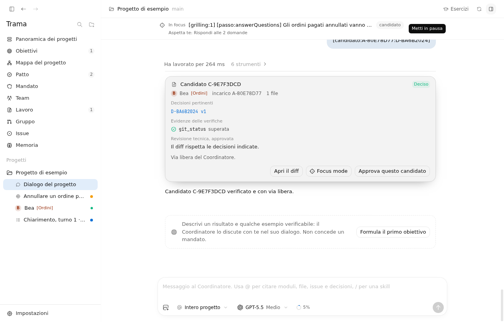
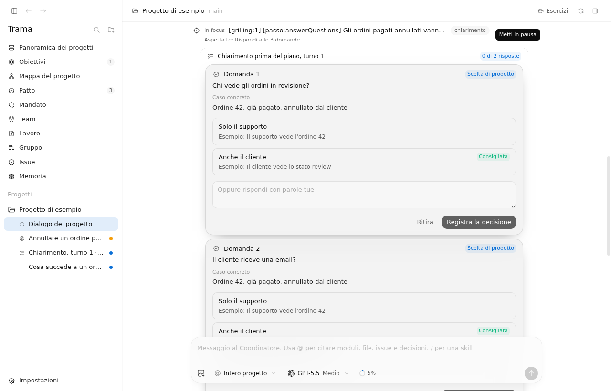
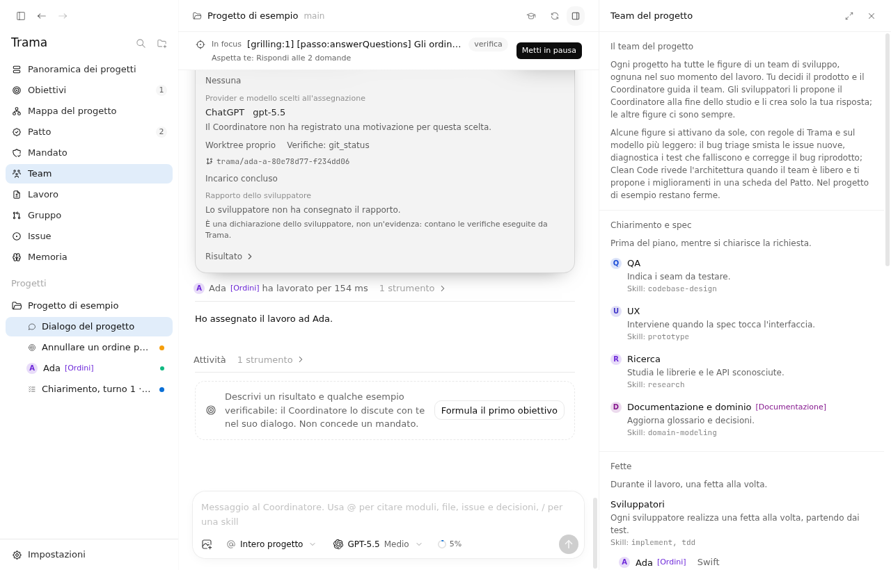
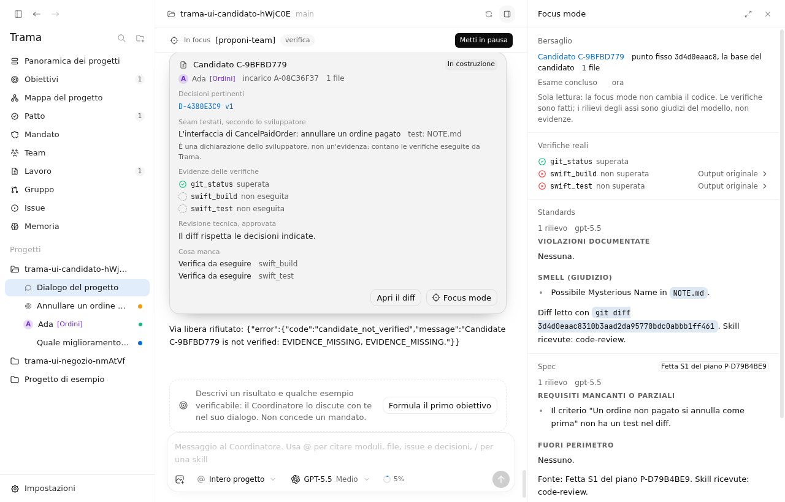
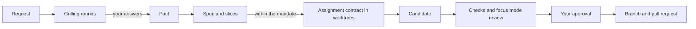

<div align="center">


# Trama

**A desktop app that coordinates AI coding agents on your repository and keeps every decision, task and check tied to the change it belongs to.**

[](https://github.com/emanueledenaro/trama/actions/workflows/electron.yml)
[](LICENSE)


[Quick start](#quick-start) · [How it works](#how-it-works) · [Providers](#providers) · [Status](#status-and-known-limits) · [Contributing](#contributing)



<sub>The sample project with a candidate, its linked decision, the check results and the diff Trama captured. Screenshot taken on Linux with the fake Codex server used by the tests.</sub>

</div>

> [!WARNING]
> Trama is in **alpha**. The base path has run with real Claude and Pi accounts. The first live run with real Codex (26 September, `gpt-6-luna`) went from a request to a developer's finished worktree, then stopped short of a verified candidate on a known bug ([verification log](docs/verifiche/v04-v05.md), [#204](https://github.com/emanueledenaro/trama/issues/204)). Read [Status and known limits](#status-and-known-limits) before relying on it.

## Why Trama

Coding agents are good at writing code and bad at remembering why. Decisions end up scattered across chat threads, an agent reports tests it never ran, and nobody can say which answer a given diff was based on.

Trama puts one **Coordinator** between you and the agents:

- You make the product decisions. The Coordinator asks, you answer, and only your answers become rules for the project (the **Pact**).
- You set how far it can go on its own (the **mandate**). Anything outside it needs you.
- Agents work in their own git worktrees. Trama runs the checks itself and ties the results to the exact diff, the decisions it depends on and the goal it serves. An AI saying "tests pass" is never taken as evidence.

## Features

- **The AI Hero method, run natively.** A request is clarified in numbered rounds with `grilling`; `domain-modeling` proposes glossary terms and ADRs from the decisions taken; `to-spec` turns the plan into a spec with the seams you confirm; `to-tickets` splits it into vertical slices with their acceptance criteria. Each developer ships a slice with `implement` and `tdd`. Bug triage, failed-check diagnosis and Clean Code's architecture review start on their own within the mandate. Every skill keeps Matt Pocock's original text, with a thin Trama binding.
- **A focused work loop.** The chat leads with the task in focus, its phase and the one next step allowed right now; the rest wait in a queue, started ones first. Inside the mandate the Coordinator takes its own next moves - preparing the plan, assigning work, running checks - and stops only for the person: product decisions, confirming the shared understanding, the mandate, the team, the seams and the slices proposed in the plan, and the merge.
- **An assignment contract and a developer's report.** Every task carries its goal, the seams to test, the Pact decisions it depends on and the checks required; Trama refuses an incomplete one. Each developer closes with a structured report of files touched, tests written and seams covered - a claim, never evidence.
- **Developers can ask, and pause.** A developer with a doubt asks the Coordinator through a tool; the slice pauses and the developer is freed while dependent slices wait. The Coordinator answers from facts, or opens a Pact decision when the answer blocks the work, and the assignment resumes in the same worktree once it is answered ([#202](https://github.com/emanueledenaro/trama/pull/202)).
- **A Clean Code standard, measured by Trama.** Work in a worktree gets Trama's own Clean Code standard, after a project's own rules and the native skills. Trama measures the argument count and length of every function the candidate adds or touches, and duplicated blocks on the added lines, as evidence for the technical review; a finding on naming, hidden side effects or duplication always blocks. Rules are configurable per project in Settings ([#201](https://github.com/emanueledenaro/trama/pull/201)).
- **Presence and collaboration.** The Group view's "Who works on what" board, the map and the focus bar show who, person or agent, is working on which branch and files, shared over dedicated git refs with your consent. Overlaps are flagged at three levels, same module, same file, real conflict, and the Coordinator itself steers new assignments away from files a colleague already has open.
- **Focus mode with native code review.** Open a candidate and Trama runs its real checks first, then two read-only passes of the `code-review` skill in parallel, Standards and Spec, against the candidate's base commit.
- **Nine providers, every role.** Codex, Claude, Cursor, Grok, Droid, Devin, OpenCode, Antigravity and Pi behind one runtime interface. Antigravity now works in every role, not only for developers: read-only for the Coordinator, planners, reviewers and checks, edits only inside a developer's own worktree.
- **Understandable provider and GitHub errors.** A rate limit, an expired quota, a missing login or an unreachable provider get a plain explanation and the matching action, retry, change model or provider, add your key, log in again, never a raw error payload. On a temporary limit the Coordinator and specialists wait with a growing backoff and resume the work themselves.
- **A publishing standard.** Trama reads a project's own conventions first (`AGENTS.md`, `CONTRIBUTING.md`, commitlint config, existing branch prefixes) and falls back to Conventional Commits and Conventional Branch. It writes the commit message and branch name itself, and publishes a candidate only when it is verified, the message is valid, no secrets or sensitive files are staged, `git diff --check` is clean, the linked issue exists and no Pact question is still open ([its ADR](docs/adr/0016-conventional-commits-e-standard-di-pubblicazione.md)).
- **A guided first run.** A brief animated intro leads into a Welcome flow for connecting a provider, GitHub and the AI Hero method, each step skippable and resumable later. The project picker then lists your recents with their phase, blockers and active colleagues, next to opening a folder, cloning from GitHub or trying the sample project.
- **Checks Trama runs itself.** `git_status`, `git_diff_check`, `swift_build`, `swift_test`, `node_test` and `node_typecheck`, with Node checks in a sandbox that allows only local networking.
- **Goals with examples.** Outcomes with accepted and rejected examples that tasks, candidates and decisions link to explicitly.
- **Memory and learning.** The Coordinator keeps notes on you and the project, searches past conversations and maintains the skills it learns, ported from Hermes Agent.
- **Repository map.** Swift and JavaScript/TypeScript projects are indexed into modules from their real paths, with secrets and symlinks excluded.

<table>
  <tr>
    <td width="33%"></td>
    <td width="33%"></td>
    <td width="33%"></td>
  </tr>
  <tr>
    <td align="center"><sub>A decision card: a concrete case, alternatives with examples, or your own words.</sub></td>
    <td align="center"><sub>The team, moment by moment.</sub></td>
    <td align="center"><sub>Focus mode: real checks first, then Standards and Spec in parallel.</sub></td>
  </tr>
</table>

The app interface and most of the documentation in `docs/` are in Italian.

## Quick start

There is no signed release yet, so Trama runs from source.

**Requirements**

- macOS, Linux or Windows, with Git and Node.js 22.
- At least one provider you are already signed in to from its CLI. For Codex this means a **ChatGPT account**: Trama refuses API keys and non-OpenAI providers for Codex, so it never moves you to API billing silently.
- Optional: [GitHub CLI](https://cli.github.com/) (`gh auth login`) for issues, pull requests and presence.
- Optional: `bubblewrap` on Linux, so Node tests that open a local server can run in Trama's sandbox. macOS uses the built-in `sandbox-exec`.

**Run it**

```bash
git clone https://github.com/emanueledenaro/trama.git
cd trama/app
npm install
npm run dev
```

**First steps**

1. On first launch, the Welcome flow asks you to connect a provider, optionally GitHub, and set up the AI Hero method; skip or resume any step later from the Help (Aiuto) menu.
2. From the project picker, open a folder, clone one from GitHub, or try the sample project.
3. Read the Coordinator's study of the project and confirm the developers it proposes.
4. Send a request. Pick a module as context with `@` or a skill with `/`.
5. Answer the rounds of questions and the mandate card. Only your answers enter the Pact and the mandate.
6. Follow the focus bar for the task in focus and the queue behind it. Inside the mandate, the Coordinator keeps moving between rounds on its own; you step in for product decisions, the mandate, the team and the merge.

## How it works



1. **Clarify.** The Coordinator reads the code for facts and asks you only what the code cannot answer, one round at a time, with `grilling`.
2. **Decide.** Each answer is a versioned decision in the Pact. Changing a decision invalidates only the work that depended on it.
3. **Plan.** `to-spec` writes the request as a spec with the seams you confirm; `to-tickets` splits it into vertical slices in dependency order.
4. **Delegate.** Within the mandate, the Coordinator assigns ready slices to developers, one each, through an assignment contract: goal, seams, decisions and checks required. Each works in a dedicated worktree with `implement` and `tdd`, and closes with a structured report.
5. **Verify.** A candidate carries its diff, the decisions it relies on and the check results Trama ran itself. Focus mode adds a read-only Standards and Spec review on demand. A later relevant change revokes the approval.
6. **Publish.** With your explicit action, Trama writes a Conventional Commit and branch name by its publishing standard, then opens the pull request through `gh`.

Throughout, presence shows who else is on the same files, and the Coordinator avoids assigning work where a colleague already has it open.

The vocabulary (Coordinator, Pact, mandate, candidate, moment, presence, focus mode) is defined in [CONTEXT.md](CONTEXT.md), and the reasons behind the design are in the [ADRs](docs/adr/).

## Providers

| Provider | Adapter | Tested with a real account |
| --- | --- | --- |
| Codex (ChatGPT) | yes | Live in the Electron app on 26 September with real `gpt-6-luna`: study, team, mandate, assignment contract and a developer's finished worktree. Stopped before a verified candidate, on a bug in `verify_candidate` ([verification log](docs/verifiche/v04-v05.md), [#204](https://github.com/emanueledenaro/trama/issues/204)) |
| Claude | yes | Base path: message, Trama tool, interrupt, restart, resume |
| Pi | yes | Base path: message, Trama tool, interrupt, restart, resume |
| Cursor, Grok, Devin, OpenCode | yes | No, fake CLIs and servers only |
| Antigravity | yes | No, fake CLI only. Every role: read-only for the Coordinator, planners, reviewers and checks, edits only in a specialist's worktree, never shell or network |
| Droid | yes | No. Not detected on the test machine |

The adapters are ported from [Synara](https://github.com/Emanuele-web04/synara) ([ADR 0012](docs/adr/0012-provider-di-synara-in-typescript.md)). Credentials stay with each provider's official CLI. Trama does not read `auth.json` or copy tokens.

## Configuration

| Variable | Purpose |
| --- | --- |
| `TRAMA_CODEX_PATH` | Codex executable to use instead of the one in `PATH` |
| `TRAMA_DATA_DIR` | Data folder to use instead of the default |

Data lives in the user data folder under `Trama/Desktop`: `~/Library/Application Support/Trama/Desktop` on macOS, `~/.config/Trama/Desktop` on Linux, `%APPDATA%\Trama\Desktop` on Windows. What the Coordinator learns is stored under `Learning/` in the same folder, never in your repository. Presence is shared over `refs/trama/presence/<user>` on your project's `origin`, only with your consent, never in the repository itself. On first launch Trama imports recent projects from the former SwiftUI version without modifying its files.

## Development

All commands run in `app/`:

```bash
npm run dev         # Vite + main process + Electron
npm run typecheck   # type check
npm test            # unit and integration tests (Vitest)
npm run build       # build the interface and the main process
npm start           # build and launch
npm run ui-check    # launch with a fake Codex and save screenshots in ui-check/
npm run dist        # package with electron-builder
```

<details>
<summary>Project structure</summary>

| Path | Contents |
| --- | --- |
| `app/src/main` | Main process: repository scanner, Coordinator, MCP tool server on `127.0.0.1`, Pact, mandate, team, goals, checks, presence, GitHub, persistence |
| `app/src/main/core/providers` | The nine provider adapters behind `AgentRuntime` |
| `app/src/main/core/learning` | Memory and learning loop ported from [Hermes Agent](https://github.com/NousResearch/hermes-agent) ([ADR 0014](docs/adr/0014-apprendimento-di-hermes.md)) |
| `app/src/main/core/nativeSkills.ts` | Delivers a bundled skill unchanged, with a binding to Trama's tools |
| `app/src/main/core/audit.ts` | Focus mode: real checks first, then the `code-review` skill on two read-only sessions |
| `app/src/main/core/presence.ts` | Presence over dedicated git refs, and overlap checks against colleagues' branches |
| `app/src/main/core/conventions.ts`, `app/src/main/core/quality.ts` | Reads a project's own commit and branch conventions, and gates publishing on the standard |
| `app/src/preload` | Typed IPC bridge. The renderer has no Node access |
| `app/src/renderer` | React, Tailwind CSS 4 and `@base-ui/react` on Synara's design tokens |
| `app/src/renderer/components/brand` | `TramaMark`, the app's woven-ribbon glyph, tinted to each provider's accent |
| `app/src/shared` | Shared types and logic: timeline, grilling rounds, team roster, presence, overlap |
| `app/resources/AIHero` | Bundled skills, license and `bundle.json` with every renamed file |
| `app/resources/DemoProject` | The sample project |
| `app/test-fixtures/fake-codex.mjs` | Fake app server for tests and `ui-check`. Its replies are not Codex results |

</details>

CI ([`electron.yml`](.github/workflows/electron.yml)) runs type check, tests, build and `ui-check` on Ubuntu with Node 22. The [`release.yml`](.github/workflows/release.yml) workflow builds packages for macOS, Windows and Linux on every `v*` tag; they are signed and notarized only when the signing secrets are set. `main` is a protected branch: changes land through a pull request, never a direct push.

## Status and known limits

- **End to end.** No candidate has yet been declared and verified end to end on a real project. The closest live run (26 September, real Codex `gpt-6-luna`) reached a developer's finished worktree and stopped before declaring a candidate, on a bug in `verify_candidate` ([verification log](docs/verifiche/v04-v05.md), [#204](https://github.com/emanueledenaro/trama/issues/204)).
- **Candidate gate.** Focus mode reviews one candidate on demand with two axes, Standards and Spec. Running every fixed role over a candidate automatically, in parallel, is still open ([#147](https://github.com/emanueledenaro/trama/issues/147)).
- **Pull requests.** Publishing is tested up to the branch push. Creating the PR with `gh` has not been tested from the app on a real repository.
- **Sandbox.** The Node sandbox with local networking is tested on macOS only. On Windows, tests that open a local server fail under the Codex sandbox. The Linux `bubblewrap` path is coded but not tested on a real Linux machine.
- **Provider switch.** Switching providers mid-conversation is verified only live.
- **Presence.** Verified against a local bare remote and, once, directly against GitHub. A remote other than GitHub or a local folder, and a repository whose CI triggers on any push, are not verified.
- **Distribution.** No signed or notarized package has been produced yet.
- **Planning docs.** Some documents in `docs/` still describe the SwiftUI version.

The complete list is in [ADR 0011](docs/adr/0011-app-desktop-electron-con-design-synara.md) and in [GitHub Issues](https://github.com/emanueledenaro/trama/issues). Code or a passing local test alone does not close a ticket; the verification logs are in [`docs/verifiche/`](docs/verifiche/).

## Contributing

Issues and pull requests are welcome. Before you start:

- Read [AGENTS.md](AGENTS.md) for the project rules and [CONTEXT.md](CONTEXT.md) for the vocabulary.
- Commits follow [Conventional Commits](https://www.conventionalcommits.org/en/v1.0.0/), for example `feat(app): add the search palette`.
- Branches follow [Conventional Branch](https://conventionalbranch.org/): `feature/`, `bugfix/` or `hotfix/` with a short English description.
- Source code, comments and commit messages are in English. The interface, issues and pull requests are in Italian.
- Run `npm run typecheck` and `npm test` in `app/` before opening a pull request. `main` is protected: only a pull request with green CI gets merged.

## Acknowledgements

- [Synara](https://github.com/Emanuele-web04/synara) for the interface and the provider adapters (MIT, [attribution](docs/synara-attribution.md)).
- [Matt Pocock's skills](https://github.com/mattpocock/skills) for the bundled skills (MIT, [attribution](docs/aihero-attribution.md)).
- [Hermes Agent](https://github.com/NousResearch/hermes-agent) for the learning loop (MIT, [attribution](docs/hermes-attribution.md)).
- [Codex](https://github.com/openai/codex) by OpenAI, installed separately and not bundled with the app.

## License

[MIT](LICENSE)
