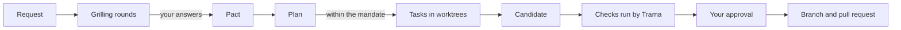

<div align="center">

# Trama

**A desktop app that coordinates AI coding agents on your repository and keeps every decision, task and check tied to the change it belongs to.**

[](https://github.com/emanueledenaro/trama/actions/workflows/electron.yml)
[](LICENSE)


[Quick start](#quick-start) · [How it works](#how-it-works) · [Providers](#providers) · [Status](#status-and-known-limits) · [Contributing](#contributing)


<sub>The sample project with a candidate, its linked decision, the check results and the diff Trama captured. Screenshot taken on Linux with the fake Codex server used by the tests.</sub>

</div>

> [!WARNING]
> Trama is in **alpha**. The base path has run with real Claude and Pi accounts, but no change has yet gone from request to verified candidate on a real project. Read [Status and known limits](#status-and-known-limits) before relying on it.

## Why Trama

Coding agents are good at writing code and bad at remembering why. Decisions end up scattered across chat threads, an agent reports tests it never ran, and nobody can say which answer a given diff was based on.

Trama puts one **Coordinator** between you and the agents:

- You make the product decisions. The Coordinator asks, you answer, and only your answers become rules for the project (the **Pact**).
- You set how far it can go on its own (the **mandate**). Anything outside it needs you.
- Agents work in their own git worktrees. Trama runs the checks itself and ties the results to the exact diff, the decisions it depends on and the goal it serves. An AI saying "tests pass" is never taken as evidence.

## Features

- **Grilling before planning.** A request is clarified in numbered rounds of decision cards, each with a recommended answer, using the original [`grilling`](docs/aihero-attribution.md) skill. The plan starts only when the round is answered.
- **A full team per project.** The developers the Coordinator proposes, plus eleven fixed roles (QA, UX, research, documentation and domain, bug triage, spec review, Clean Code, regression guardian, security, performance, DevOps), each with its moment in the flow.
- **Goals with examples.** Outcomes with accepted and rejected examples that tasks, candidates and decisions link to explicitly.
- **Checks Trama runs itself.** `git_status`, `git_diff_check`, `swift_build`, `swift_test`, `node_test` and `node_typecheck`, with Node checks in a sandbox that allows only local networking.
- **Nine providers.** Codex, Claude, Cursor, Grok, Droid, Devin, OpenCode, Antigravity and Pi behind one runtime interface.
- **Skills included.** The full set of Matt Pocock's engineering and productivity skills, callable with `/` in the composer.
- **Memory and learning.** The Coordinator keeps notes on you and the project, searches past conversations and maintains the skills it learns, ported from Hermes Agent.
- **Repository map.** Swift and JavaScript/TypeScript projects are indexed into modules from their real paths, with secrets and symlinks excluded.

<table>
  <tr>
    <td width="50%"></td>
    <td width="50%"></td>
  </tr>
  <tr>
    <td align="center"><sub>A decision card: a concrete case, alternatives with examples, or your own words.</sub></td>
    <td align="center"><sub>The team, moment by moment.</sub></td>
  </tr>
</table>

The app interface and most of the documentation in `docs/` are in Italian.

## Quick start

There is no signed release yet, so Trama runs from source.

**Requirements**

- macOS, Linux or Windows, with Git and Node.js 22.
- At least one provider you are already signed in to from its CLI. For Codex this means a **ChatGPT account**: Trama refuses API keys and non-OpenAI providers for Codex, so it never moves you to API billing silently.
- Optional: [GitHub CLI](https://cli.github.com/) (`gh auth login`) for issues and pull requests.
- Optional: `bubblewrap` on Linux, so Node tests that open a local server can run in Trama's sandbox. macOS uses the built-in `sandbox-exec`.

**Run it**

```bash
git clone https://github.com/emanueledenaro/trama.git
cd trama/app
npm install
npm run dev
```

**First steps**

1. Open a project, or the sample project from the start screen.
2. The introductory guide checks your providers and GitHub. You can reopen it from the Help (Aiuto) menu, and manage connections in Settings (Impostazioni).
3. Read the Coordinator's study of the project and confirm the developers it proposes.
4. Send a request. Pick a module as context with `@` or a skill with `/`.
5. Answer the rounds of questions and the mandate card. Only your answers enter the Pact and the mandate.

## How it works



1. **Clarify.** The Coordinator reads the code for facts and asks you only what the code cannot answer, one round at a time.
2. **Decide.** Each answer is a versioned decision in the Pact. Changing a decision invalidates only the work that depended on it.
3. **Delegate.** Within the mandate, the Coordinator assigns tasks to developers. Each works in a dedicated worktree, with its provider and model recorded.
4. **Verify.** A candidate carries its diff, the decisions it relies on and the check results. Trama runs the checks itself; a later relevant change revokes the approval.
5. **Publish.** With your explicit action, Trama prepares an immutable commit and opens the pull request through `gh`.

The vocabulary (Coordinator, Pact, mandate, candidate, moment) is defined in [CONTEXT.md](CONTEXT.md), and the reasons behind the design are in the [ADRs](docs/adr/).

## Providers

| Provider | Adapter | Tested with a real account |
| --- | --- | --- |
| Codex (ChatGPT) | yes | Not yet in the Electron app: the test account had used up its quota ([V09](docs/verifiche/v09-trama-su-trama-2026-09-24.md)) |
| Claude | yes | Base path: message, Trama tool, interrupt, restart, resume |
| Pi | yes | Base path: message, Trama tool, interrupt, restart, resume |
| Cursor, Grok, Devin, OpenCode | yes | No, fake CLIs and servers only |
| Antigravity | yes | No. Works only in a worktree, without shell or network |
| Droid | yes | No. Not detected on the test machine |

The adapters are ported from [Synara](https://github.com/Emanuele-web04/synara) ([ADR 0012](docs/adr/0012-provider-di-synara-in-typescript.md)). Credentials stay with each provider's official CLI. Trama does not read `auth.json` or copy tokens.

## Configuration

| Variable | Purpose |
| --- | --- |
| `TRAMA_CODEX_PATH` | Codex executable to use instead of the one in `PATH` |
| `TRAMA_DATA_DIR` | Data folder to use instead of the default |

Data lives in the user data folder under `Trama/Desktop`: `~/Library/Application Support/Trama/Desktop` on macOS, `~/.config/Trama/Desktop` on Linux, `%APPDATA%\Trama\Desktop` on Windows. What the Coordinator learns is stored under `Learning/` in the same folder, never in your repository. On first launch Trama imports recent projects from the former SwiftUI version without modifying its files.

## Development

All commands run in `app/`:

```bash
npm run dev         # Vite + main process + Electron
npm run typecheck   # type check
npm test            # unit and integration tests (Vitest)
npm run build       # build the interface and the main process
npm start           # build and launch
npm run ui-check    # launch with a fake Codex and save screenshots in ui-check/
npm run dist        # package with electron-builder
```

<details>
<summary>Project structure</summary>

| Path | Contents |
| --- | --- |
| `app/src/main` | Main process: repository scanner, Coordinator, MCP tool server on `127.0.0.1`, Pact, mandate, team, goals, checks, GitHub, persistence |
| `app/src/main/core/providers` | The nine provider adapters behind `AgentRuntime` |
| `app/src/main/core/learning` | Memory and learning loop ported from [Hermes Agent](https://github.com/NousResearch/hermes-agent) ([ADR 0014](docs/adr/0014-apprendimento-di-hermes.md)) |
| `app/src/main/core/nativeSkills.ts` | Delivers a bundled skill unchanged, with a binding to Trama's tools |
| `app/src/preload` | Typed IPC bridge. The renderer has no Node access |
| `app/src/renderer` | React, Tailwind CSS 4 and `@base-ui/react` on Synara's design tokens |
| `app/src/shared` | Shared types and logic: timeline, grilling rounds, team roster |
| `app/resources/AIHero` | Bundled skills, license and `bundle.json` with every renamed file |
| `app/resources/DemoProject` | The sample project |
| `app/test-fixtures/fake-codex.mjs` | Fake app server for tests and `ui-check`. Its replies are not Codex results |

</details>

CI ([`electron.yml`](.github/workflows/electron.yml)) runs type check, tests, build and `ui-check` on Ubuntu with Node 22. The [`release.yml`](.github/workflows/release.yml) workflow builds packages for macOS, Windows and Linux on every `v*` tag; they are signed and notarized only when the signing secrets are set.

## Status and known limits

- **End to end.** No candidate has yet been declared and verified from start to finish on a real project. The full Codex path still has to run.
- **Fixed roles.** The team shows each role's moment, but running the roles at their moment is still open ([#147](https://github.com/emanueledenaro/trama/issues/147), [#148](https://github.com/emanueledenaro/trama/issues/148)).
- **Pull requests.** Publishing is tested up to the branch push. Creating the PR with `gh` has not been tested on a real repository.
- **Sandbox.** The Node sandbox with local networking is tested on macOS only. On Windows, tests that open a local server fail under the Codex sandbox.
- **Provider switch.** Switching providers mid-conversation is verified only live.
- **Distribution.** No signed or notarized package has been produced yet.
- **Planning docs.** Some documents in `docs/` still describe the SwiftUI version.

The complete list is in [ADR 0011](docs/adr/0011-app-desktop-electron-con-design-synara.md) and in [GitHub Issues](https://github.com/emanueledenaro/trama/issues). Code or a passing local test alone does not close a ticket.

## Contributing

Issues and pull requests are welcome. Before you start:

- Read [AGENTS.md](AGENTS.md) for the project rules and [CONTEXT.md](CONTEXT.md) for the vocabulary.
- Commits follow [Conventional Commits](https://www.conventionalcommits.org/en/v1.0.0/), for example `feat(app): add the search palette`.
- Branches use `feature/`, `bugfix/` or `hotfix/` with a short English description.
- Source code, comments and commit messages are in English. The interface, issues and pull requests are in Italian.
- Run `npm run typecheck` and `npm test` in `app/` before opening a pull request.

## Acknowledgements

- [Synara](https://github.com/Emanuele-web04/synara) for the interface and the provider adapters (MIT, [attribution](docs/synara-attribution.md)).
- [Matt Pocock's skills](https://github.com/mattpocock/skills) for the bundled skills (MIT, [attribution](docs/aihero-attribution.md)).
- [Hermes Agent](https://github.com/NousResearch/hermes-agent) for the learning loop (MIT, [attribution](docs/hermes-attribution.md)).
- [Codex](https://github.com/openai/codex) by OpenAI, installed separately and not bundled with the app.

## License

[MIT](LICENSE)
