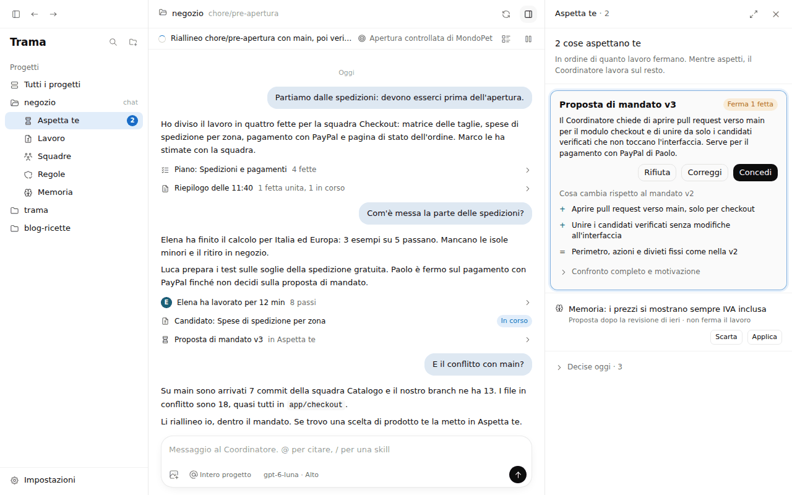
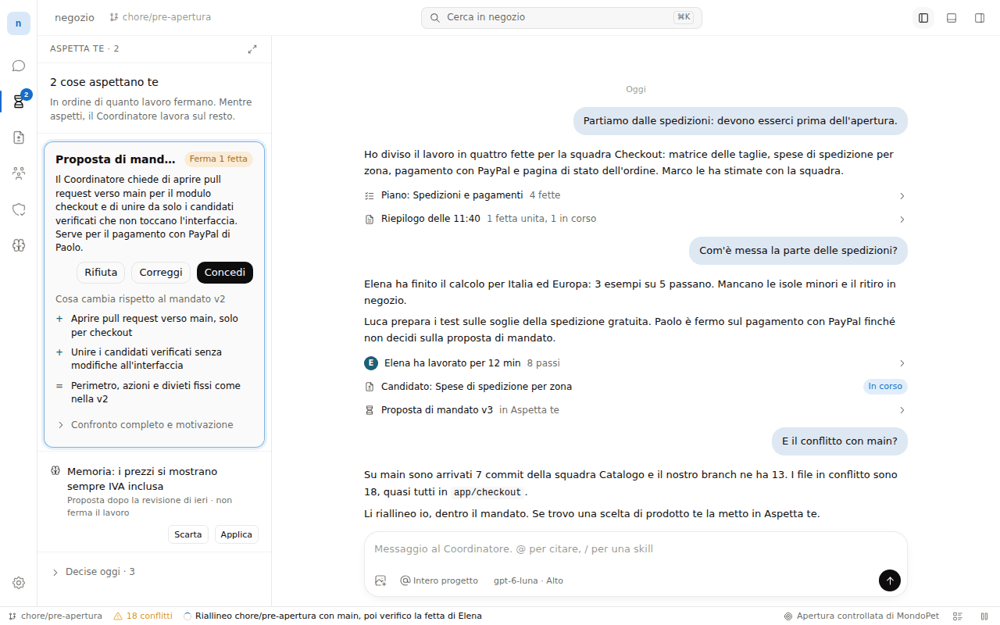
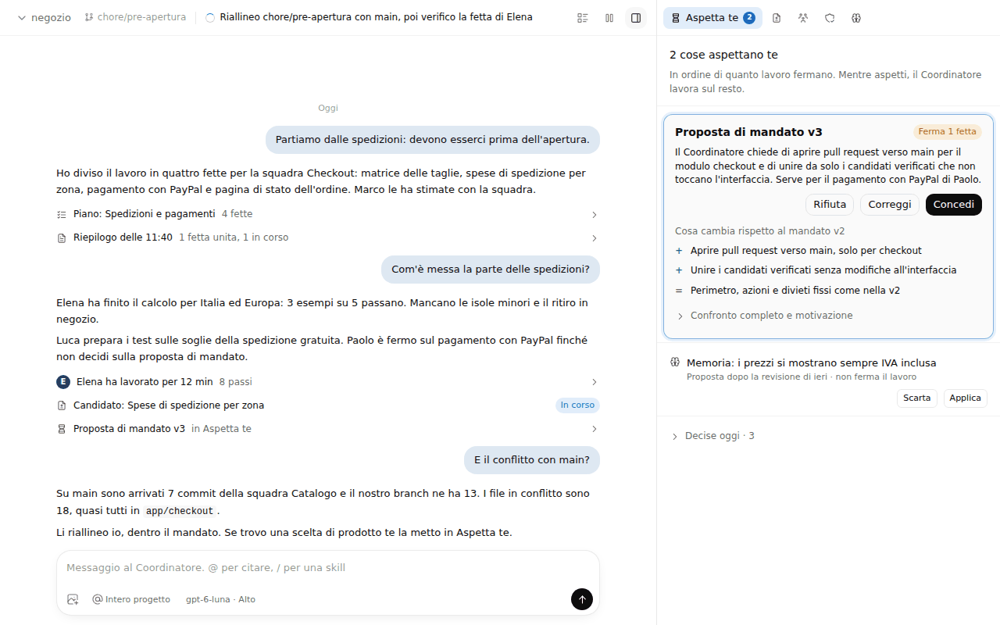

# Riorganizzare le schermate di Trama: proposta

Fase di proposta della issue #314, 28 settembre 2026. Niente codice dell'app: principi, tre alternative di disposizione come prototipi HTML statici, schermate e misure. Parte dal rapporto dell'audit nel commento della issue.

## Cosa c'è

| File | Contenuto |
|---|---|
| [principi.md](principi.md) | Una domanda per zona dello schermo, regole trasversali, vocabolario, tabella dei pulsanti da trasformare in icone, destinazione delle 16 viste di oggi |
| [alternative.md](alternative.md) | Le tre alternative: cosa sparisce, cosa si unisce, cosa si sposta, cosa diventa icona, misure, confronto e consiglio |
| `prototipi/a.html`, `b.html`, `c.html` | I prototipi. Si aprono nel browser; in basso a destra si sceglie la vista e il tema |
| `prototipi/proto.js`, `proto.css` | Dati del progetto negozio e contenuto delle viste, comuni alle tre alternative |
| `prototipi/tokens.css`, `icons.js` | Generati: token di `app/src/renderer/index.css` e icone Tabler del renderer |
| `schermate/` | 78 schermate: 9 stati per alternativa, chiaro e scuro, a 1280x800; finestra principale, Squadre, Specialista e Lavoro anche a 1680x1050 |
| `misure.json` | Altezza e larghezza della conversazione e pulsanti visibili, per ogni stato, a 1280x800, 1066x666 e 1680x1050 |
| `genera.mjs`, `riduci.py` | Script che rigenerano token, icone, schermate e misure |

## Le tre alternative in breve

| A. Albero del progetto | B. Barra delle attività | C. Chat e pannello a schede |
|---|---|---|
|  |  |  |
| Progetti e cinque viste nella barra laterale, vista nell'ispettore a destra | Icone a sinistra come VS Code, vista nella barra laterale, dettaglio come scheda dell'editor, Attività in basso, barra di stato | Niente barra laterale, stato nella barra in alto, un pannello a destra con cinque schede |
| Conversazione 576 px a 1280x800 | 586 px | 610 px |

Oggi la conversazione ha 402 px con l'ispettore aperto. Il consiglio e il confronto sono in [alternative.md](alternative.md#confronto-e-consiglio).

## Stati di ogni prototipo

`?vista=` sceglie lo stato e `?tema=chiaro|scuro` il tema:

`principale`, `aspetta`, `squadre`, `specialista`, `lavoro`, `regole`, `memoria`, `panoramica`, `impostazioni`.

Per esempio `prototipi/b.html?vista=squadre&tema=scuro`.

## Come rigenerare

Dalla radice del repository, dopo `npm ci` in `app/`:

```
node docs/design/schermate-2026-09-28/genera.mjs
python3 docs/design/schermate-2026-09-28/riduci.py
```

`genera.mjs` rilegge i token da `app/src/renderer/index.css` e le icone da `app/node_modules/@tabler/icons`, poi apre ogni stato in Chromium con Playwright, salva le schermate e scrive `misure.json`. Se Playwright non trova il suo Chromium, `CHROMIUM_PATH` indica un altro eseguibile. `--no-shots` rigenera solo token e icone. `riduci.py` porta le PNG a 256 colori (serve Pillow) e dimezza il peso della cartella.

Le schermate di questa cartella sono state fatte su Linux con Chromium 141 e il carattere DejaVu Sans; i limiti sono in [alternative.md](alternative.md#cosa-non-è-verificato).
