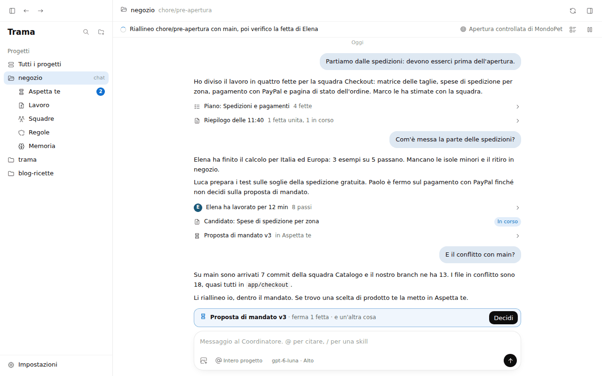
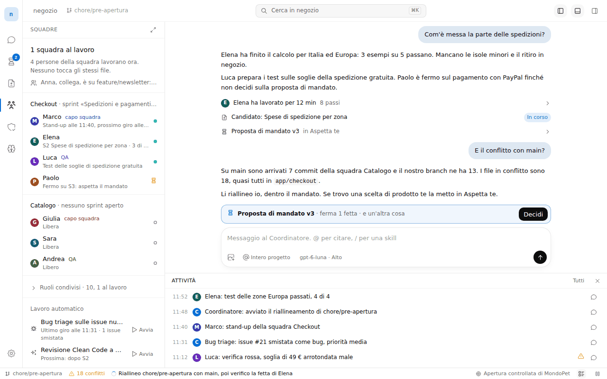
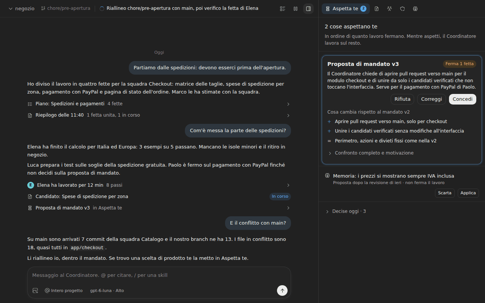

# Tre alternative di disposizione

Proposta per la issue #314. Le tre alternative applicano gli stessi [principi](principi.md) e mettono le zone in punti diversi. I prototipi sono in `prototipi/` (`a.html`, `b.html`, `c.html`), le schermate in `schermate/`, le misure in `misure.json`. Come rigenerarli è scritto nel [README](README.md).

Dati dei prototipi: progetto negozio, branch `chore/pre-apertura`, obiettivo "Apertura controllata di MondoPet". Un lavoro in corso (S2 Spese di spedizione per zona, di Elena), due cose che aspettano la persona (proposta di mandato v3, proposta di memoria), una squadra al lavoro (Checkout) e una ferma (Catalogo), un conflitto (18 file tra `chore/pre-apertura` e main, che il Coordinatore sta riallineando). Sono dati di esempio scritti a mano, non letti dall'app.

## Dove sta ogni zona

| Domanda | A. Albero del progetto | B. Barra delle attività | C. Chat e pannello a schede |
|---|---|---|---|
| Dove sono? | testata della chat | barra del titolo | barra in alto, a sinistra |
| Cosa succede adesso? | riga di stato sotto la testata | barra di stato in fondo alla finestra | barra in alto, dopo il branch |
| Cosa ci siamo detti? | chat al centro | chat come area dell'editor | chat a sinistra |
| Cosa devo fare io? | riga sopra il composer, vista Aspetta te | come A | come A |
| Cosa c'è in quello che ho aperto? | ispettore a destra | barra laterale a sinistra, scheda nell'editor per il dettaglio | pannello a destra con cinque schede |
| Dove posso andare? | barra laterale ad albero | barra delle attività a icone | schede del pannello, menu del progetto |

## Comune alle tre alternative

**Sparisce**

- La riga del primo piano con il bordo tratteggiato e il pulsante "Metti in pausa" (diventa "Metti da parte" nel menu della coda).
- La fascia fissa dell'avviso di divergenza e il pulsante pieno "Chiedi al Coordinatore come riallineare".
- Le copie di "Concedi il mandato" nella riga di stato, nel prossimo passo in chat e nella fascia sopra il composer.
- I badge di Mandato, Memoria, Patto, Team e Issue; resta solo quello di Aspetta te.
- I 5 sviluppatori nella barra laterale e la riga "Chat del Coordinatore".
- La vista Gruppo, i doppioni di Presenza, Monitor e Apprendimento, il modulo "Correggi il mandato" sempre aperto.
- Gli id nelle righe compatte, i 9 tag "Obiettivo: …" quando la chat ha un solo obiettivo.
- Il misuratore del contesto sotto la soglia.

**Si unisce**

- Riga del primo piano e riga di stato: una frase, l'obiettivo, Attività e Pausa.
- Obiettivi, Lavoro, Issue e la parte GitHub di Gruppo: vista Lavoro.
- Team, Specialista e Lavoro automatico: vista Squadre.
- Candidato ed Esame approfondito: una vista.
- Patto e Mandato in Regole; lo Standard del codice in Regole in A e B, nelle impostazioni del progetto in C (vedi [Regole](#regole-unire-patto-mandato-e-standard-del-codice)).
- Mappa nel Mandato, come sezione "Moduli".
- Memoria e Impostazioni, Apprendimento: Memoria, sezione "Come impara".

**Si sposta**

- La proposta di mandato e la proposta di memoria in Aspetta te, con i pulsanti in cima alla scheda; Mandato e Memoria tengono una riga di rimando.
- Il conflitto con main nella riga di stato mentre il Coordinatore riallinea, e in Lavoro con i file.
- Chi altro lavora sul repository nel riepilogo di Squadre.
- I dati dell'account GitHub in Impostazioni, Collegamenti.
- Nella scheda della persona: colore e copia di lavoro in fondo, Rinomina e Togli dalla squadra in un menu.

**Diventa icona**: Attività, Pausa, Mostra i file del conflitto, Apri il diff, Esame approfondito, Apri su GitHub, Nuova issue, Nuova decisione, Aggiungi nota, Modifica, Apri, Fissa e Archivia skill, Rivedi ora, Mostra nella chat, Verifica e Capacità dei provider. La tabella completa è in [principi.md](principi.md#icone-per-le-azioni-secondarie).

## A. Albero del progetto

La barra laterale elenca i progetti e, sotto quello aperto, le sue cinque viste. La chat resta al centro e la vista si apre nell'ispettore a destra. È la più vicina alla finestra di oggi.

Disposizione a 1280x800: barra laterale 240 px, ispettore 400 px (a 1680 px: 256 e 480). Testata 46 px, riga di stato 34 px. L'ispettore si chiude e lascia tutta la larghezza alla chat.

**Cosa sparisce in più**: il menu Pannelli della testata (le viste sono sempre nella barra laterale). La voce "Panoramica dei progetti" come riga separata: diventa "Tutti i progetti" in cima all'elenco.

**Cosa si unisce**: le 10 viste del progetto diventano 5 voci sotto il nome del progetto. Il nome del progetto apre la chat.

**Cosa si sposta**: le viste scendono sotto "negozio", non stanno più sopra "Progetti". Panoramica e Impostazioni prendono il posto della chat e dell'ispettore, con la barra laterale sempre visibile. "Mostra il pannello" riapre l'ultima vista, non la Mappa.

**Cosa diventa icona**: oltre al comune, Allarga e Chiudi dell'ispettore (già icone oggi).

Schermate: [Aspetta te](schermate/a-aspetta-chiaro.png) ([scuro](schermate/a-aspetta-scuro.png)), [Squadre](schermate/a-squadre-chiaro.png), [Specialista](schermate/a-specialista-chiaro.png), [Lavoro](schermate/a-lavoro-chiaro.png), [Regole](schermate/a-regole-scuro.png), [Memoria](schermate/a-memoria-chiaro.png), [Panoramica](schermate/a-panoramica-chiaro.png), [Impostazioni](schermate/a-impostazioni-chiaro.png), [finestra larga](schermate/a-principale-scuro-larga.png).

## B. Barra delle attività

Come VS Code. Una barra di icone a sinistra (48 px) sceglie la vista, che si apre in una barra laterale attaccata. La chat è l'area dell'editor; un dettaglio (una persona della squadra, un candidato, le Impostazioni) si apre come scheda accanto alla Conversazione, e affiancato alla chat quando la finestra è larga. Attività è un pannello in basso, attaccato con un separatore orizzontale. Cosa succede adesso sta nella barra di stato in fondo.

Disposizione a 1280x800: barra delle attività 48 px, barra laterale 300 px (340 a 1680 px), pannello Attività 200 px (260). Barra del titolo 46 px con la ricerca al centro, barra di stato 24 px. Le schede dell'editor compaiono solo quando è aperto qualcosa oltre alla Conversazione.

**Cosa sparisce in più**: la riga di stato sopra la chat (diventa la barra di stato); il marchio "Trama" e l'elenco dei progetti nella barra laterale (i progetti sono nel menu del nome del progetto e nella scheda Progetti).

**Cosa si unisce**: branch, conflitto, riga di stato, obiettivo, Attività e Pausa nella barra di stato. Ricerca e nome del progetto nella barra del titolo.

**Cosa si sposta**: le viste passano da destra a sinistra; il dettaglio passa nell'area dell'editor; Attività in basso; Panoramica e Impostazioni diventano schede dell'editor.

**Cosa diventa icona**: le cinque viste, Progetti e Impostazioni (solo icona, con tooltip e badge per Aspetta te); i tre interruttori dei pannelli nella barra del titolo.

Schermate: [finestra principale](schermate/b-principale-chiaro.png) ([scuro](schermate/b-principale-scuro.png)), [Aspetta te](schermate/b-aspetta-chiaro.png), [Specialista](schermate/b-specialista-chiaro.png) ([larga, affiancata](schermate/b-specialista-chiaro-larga.png)), [Lavoro](schermate/b-lavoro-chiaro.png), [Regole](schermate/b-regole-scuro.png), [Memoria](schermate/b-memoria-chiaro.png), [Panoramica](schermate/b-panoramica-chiaro.png), [Impostazioni](schermate/b-impostazioni-chiaro.png), [Squadre larga](schermate/b-squadre-scuro-larga.png).

## C. Chat e pannello a schede

Senza barra laterale. La barra in alto dice dove si è e cosa succede adesso, la chat occupa la finestra, un solo pannello a destra ha cinque schede: Aspetta te, Lavoro, Squadre, Regole, Memoria. Progetti e Impostazioni sono pagine intere.

Disposizione a 1280x800: pannello 440 px (520 a 1680 px), barra in alto 46 px. A 440 px solo la scheda aperta mostra il nome; le altre sono icone con tooltip. A 520 px tutte hanno il nome.

**Cosa sparisce in più**: la barra laterale intera, con marchio, ricerca e cronologia (indietro e avanti); la riga di stato come riga a sé.

**Cosa si unisce**: testata e riga di stato in una barra; progetti e Panoramica nel menu del nome del progetto.

**Cosa si sposta**: lo Standard del codice resta nelle impostazioni del progetto; Attività si apre nel pannello dall'icona della barra in alto; la ricerca va in una scorciatoia da tastiera.

**Cosa diventa icona**: le schede del pannello non aperte, alla larghezza predefinita.

Schermate: [finestra principale](schermate/c-principale-chiaro.png) ([scuro](schermate/c-principale-scuro.png)), [Squadre](schermate/c-squadre-chiaro.png), [Specialista](schermate/c-specialista-chiaro.png), [Lavoro](schermate/c-lavoro-chiaro.png), [Regole](schermate/c-regole-chiaro.png), [Memoria](schermate/c-memoria-chiaro.png), [Panoramica](schermate/c-panoramica-chiaro.png), [Impostazioni](schermate/c-impostazioni-chiaro.png), [Squadre larga](schermate/c-squadre-scuro-larga.png).

## Misure

Misurate da `genera.mjs` sui prototipi in Chromium, tema chiaro. "Conversazione" è l'area della cronologia tra le barre in alto e il blocco del composer. "Pulsanti visibili" conta gli elementi `button` e le schede nella parte visibile: non conta righe cliccabili e link, quindi non si confronta uno a uno con i 61 elementi cliccabili dell'audit.

Riferimento di oggi, dall'audit: a 1280x800 la conversazione ha 402 px di altezza e 584 di larghezza con l'ispettore aperto, 414 px con l'ispettore chiuso; al 120% (1066x666) 281 px. Tre pulsanti pieni, due per la stessa cosa.

### Altezza utile della conversazione (px)

| Stato | Oggi | A | B | C |
|---|---|---|---|---|
| 1280x800, finestra principale | 414 | 576 | 586 | 610 |
| 1280x800, con una vista aperta | 402 | 576 | 586 | 610 |
| 1280x800, con Aspetta te aperta (la riga sopra il composer sparisce) | | 624 | 634 | 658 |
| 1280x800, con Attività aperta | | | 386 | |
| 1066x666 (1280x800 al 120%), con una vista aperta | 281 | 442 | 452 | 476 |
| 1680x1050, con una vista aperta | | 826 | 836 | 860 |

### Larghezza della conversazione con una vista aperta (px)

| Finestra | Oggi | A | B | C |
|---|---|---|---|---|
| 1280x800 | 584 | 640 | 932 | 840 |
| 1066x666 | 420, con l'ispettore sopra la chat | 426 | 718 | 626 |
| 1680x1050 | | 944 | 1292 | 1160 |

La colonna del testo resta al massimo 46rem (736 px) come oggi. In B, a 1280x800, il dettaglio di una persona prende il posto della chat in una scheda; da 1500 px di larghezza si affianca alla chat (801 px di altezza).

### Pulsanti visibili insieme, 1280x800

| Stato | A | B | C |
|---|---|---|---|
| Finestra principale | 14 (2 testo, 1 icona e testo, 11 icona) | 19 (4, 2, 13) | 9 (2, 2, 5) |
| Aspetta te | 20 | 24 | 18 |
| Squadre | 18 | 30, con Attività | 16 |
| Memoria | 27 | 31 | 25 |
| Impostazioni, Collegamenti | 26 | 37 | 23 |
| Pulsanti pieni | 1 in ogni vista del progetto | 1 | 1 |

I valori per ogni stato e finestra sono in `misure.json`.

## Regole: unire Patto, Mandato e Standard del codice?

Oggi tre posti dicono "regole" in modo diverso: il Patto (decisioni di prodotto), il Mandato (cosa può fare il Coordinatore da solo) e lo Standard del codice (in Impostazioni, ma vale per il progetto aperto). La persona si chiede una cosa sola, "cosa vale in questo progetto?", e le tre parti si cambiano di rado.

Le alternative provano tre risposte:

- **A, una vista con tre sezioni in fila**: Mandato, Patto, Standard. Si legge tutto con uno scorrimento; il Mandato è primo perché è quello che cambia più spesso ed è collegato ad Aspetta te.
- **B, una vista con tre schede**: Mandato, Patto, Standard. Più ordinata in 300 px di larghezza, ma una scheda nasconde le altre due.
- **C, Patto e Mandato insieme, Standard nelle impostazioni del progetto**: lo Standard è una configurazione che si tocca una volta, più vicina a Metodo di lavoro che alle decisioni di prodotto.

Consiglio: unire tutte e tre in una vista "Regole" con sezioni in fila (A). Lo Standard del codice vale per il progetto aperto (`SettingsView.tsx`, sezione `standard`), quindi sta meglio con le altre regole del progetto che nelle impostazioni dell'app. Con le sezioni chiuse di default la vista resta corta.

## Confronto e consiglio

| | A. Albero del progetto | B. Barra delle attività | C. Chat e pannello a schede |
|---|---|---|---|
| Guadagno di altezza sulla conversazione a 1280x800 | +174 px | +184 px | +208 px |
| Pulsanti visibili nella finestra principale | 14 | 19 | 9 |
| Progetti sempre in vista | sì | no, nel menu | no, nel menu |
| Dettaglio accanto alla chat | sì, nell'ispettore | solo da 1500 px | sì, nel pannello |
| Pannelli attaccati come VS Code (#234) | barra laterale e ispettore, 2 separatori | barra laterale, editor diviso, pannello in basso, 3 separatori | un pannello, 1 separatore |
| Quanto cambia rispetto a oggi | poco: stessi pannelli, meno voci | molto: nuova barra delle attività, barra di stato, schede dell'editor | medio: via la barra laterale, pannello a schede |
| Rischio | la barra laterale può tornare a riempirsi | più cromatura, più pulsanti; a 1280 il dettaglio copre la chat | a 440 px le schede sono icone; chi usa più progetti perde l'elenco |

Consiglio A per la prima fase. Ottiene quasi tutto il guadagno (+174 px, un solo pulsante pieno, una sola casa per le cose che aspettano) senza cambiare i pannelli che esistono già (`Sidebar.tsx`, `Inspector.tsx`, i due `Sash`), quindi si può fare a fette piccole. B conviene se si vuole la disposizione di VS Code fino in fondo; C se la conversazione conta più del passaggio tra progetti.

La persona sceglie un'alternativa, o una combinazione (per esempio A con la barra in alto di C); poi la proposta scelta diventa fette da implementare.

## Cosa non è verificato

- I prototipi sono HTML statici con dati scritti a mano: non sono l'app e non passano da React, Tailwind o Electron. Riprendono token, misure e icone del renderer (`tokens.css` e `icons.js` sono generati da `index.css` e da `@tabler/icons`).
- Le schermate sono fatte in Chromium su Linux con il carattere di sistema (DejaVu Sans), come ui-check; su macOS il carattere è più stretto e le righe troncate cambiano.
- Solo il tema Codex, chiaro e scuro. Gli altri provider cambiano solo i colori dei token, che i prototipi leggono dalle stesse variabili.
- I nomi del vocabolario sono proposte da confermare con la persona.
