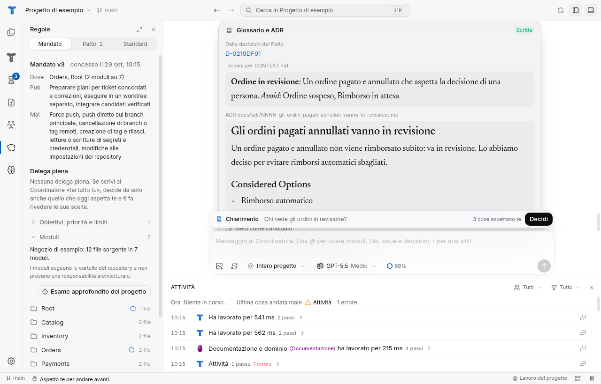
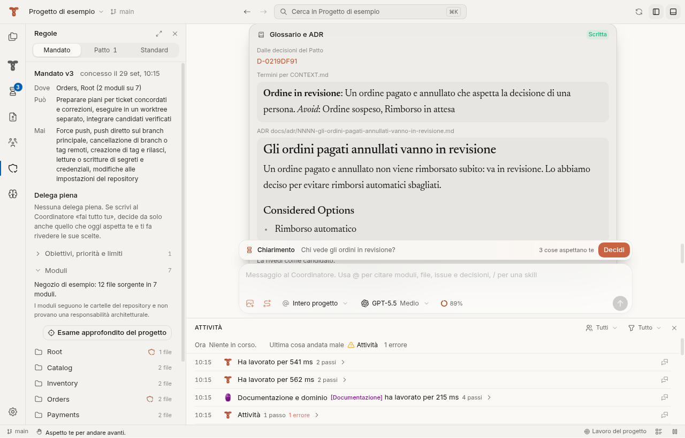
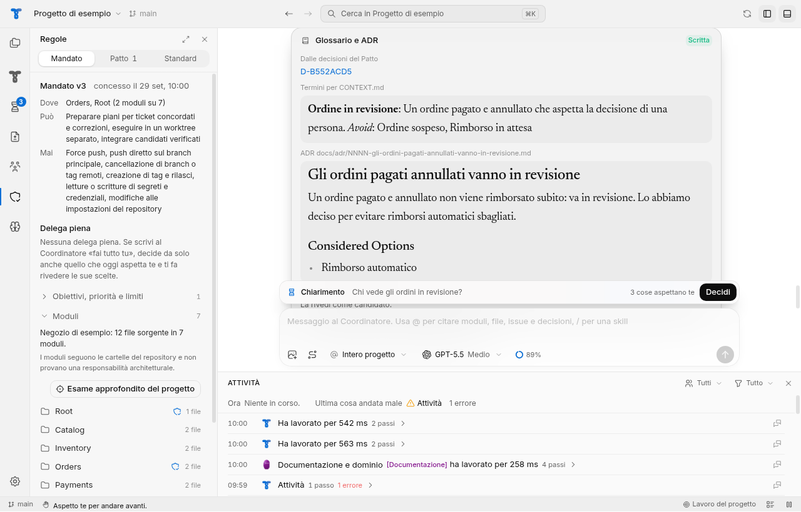
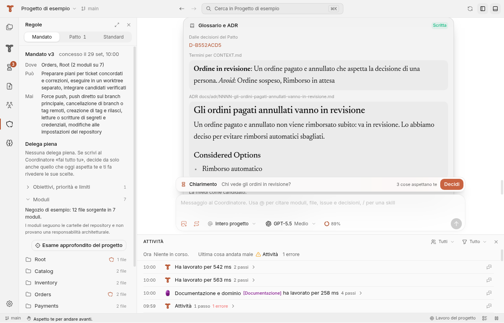
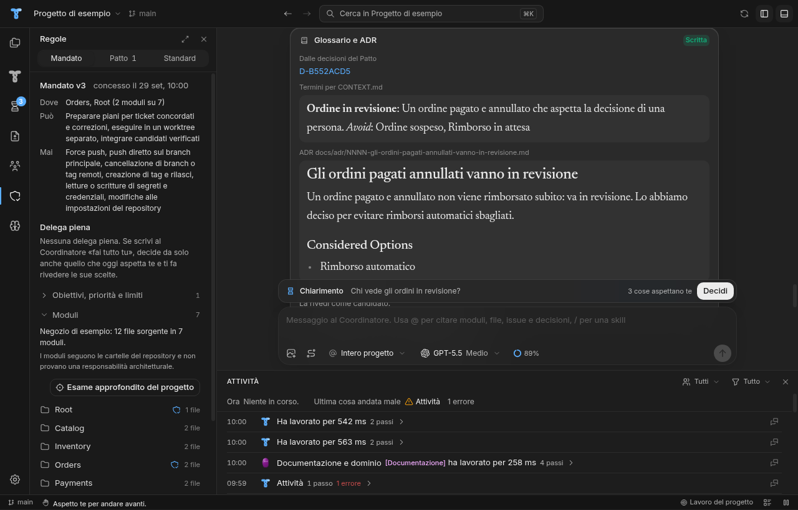
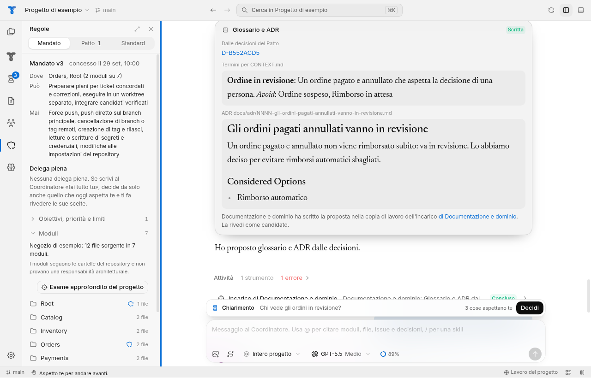
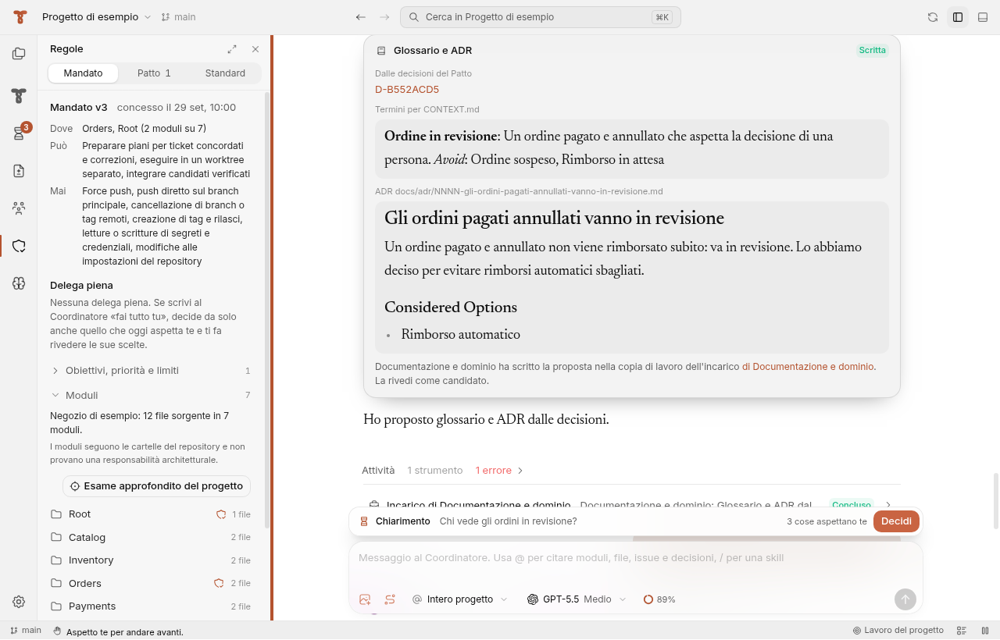

# Issue #457: superficie neutra, il provider cambia solo gli accenti (29 settembre 2026)

Verifiche eseguite su Linux con xvfb, in un container senza Codex reale e senza `gh`, sul branch `feature/issue-457-neutral-surface-provider-accents-bl8wni` con `origin/main` a `b18ed6c`. Le schermate vengono da `scripts/ui-check.mjs` con l'app-server Codex di prova, finestra 1280x820, vista Regole con il pannello in basso aperto. Le schermate "prima" vengono dallo stesso passo eseguito su `main` a `b18ed6c` e fermato subito dopo. Su Linux non c'è vetro: le tinte sono opache. Il vetro di macOS e Windows non è stato provato.

## Cosa è stato provato

- `app/src/renderer/lib/providerTheme.test.ts`: i blocchi dei nove provider, in chiaro e in scuro, dichiarano solo gli accenti (`--provider-light`, `--color-text-accent`, `--primary`, `--primary-foreground`, `--ring`, `--app-user-message-background`, `--sidebar-selected`); la superficie è `#FFFFFF` in chiaro e `#212121` in scuro; le cinque tinte delle sezioni sono diverse fra loro e vicine alla superficie; il separatore acceso usa l'accento; il velo sul vetro usa la luce neutra.
- `app/src/shared/identity.test.ts`: le tinte degli agenti restano leggibili sulla superficie e su ogni tinta delle sezioni, in chiaro e in scuro.
- ui-check, passo `22b-surface-*`: con ciascuno dei nove provider, in chiaro e in scuro, lo sfondo calcolato della pagina, della barra del titolo, della barra delle attività, della barra laterale, dell'editor, del pannello in basso e della barra di stato è uguale a quello con Codex, e non cambia dopo la dissolvenza di 1,4 s. Le sezioni hanno tinte diverse fra loro. Testo d'accento, anello di focus, selezione, fumetto, separatore e pulsante principale sono diversi fra Codex e Claude.
- ui-check, passo `22-sash-hover-*`: il separatore acceso ha l'accento del provider, `rgb(10, 111, 214)` e `rgb(90, 174, 255)` con Codex, diverso con Claude.

## Valori calcolati

| Sezione | Prima, Codex chiaro | Prima, Claude chiaro | Dopo, ogni provider, chiaro | Prima, Codex scuro | Prima, Claude scuro | Dopo, ogni provider, scuro |
| --- | --- | --- | --- | --- | --- | --- |
| Pagina ed editor | `#FFFFFF` | `#FAF9F5` | `#FFFFFF` | `#212121` | `#262624` | `#212121` |
| Pannello in basso | `#FFFFFF` | `#FAF9F5` | `#FAFAFA` | `#212121` | `#262624` | `#1D1D1D` |
| Barra laterale | `#F7F7F7` | `#F2F2EE` | `#F7F7F7` | `#1A1A1A` | `#1E1E1C` | `#1A1A1A` |
| Barra delle attività e del titolo | `#F7F7F7` | `#F2F2EE` | `#F2F2F2` | `#1A1A1A` | `#1E1E1C` | `#171717` |
| Barra di stato | `#F7F7F7` | `#F2F2EE` | `#EEEEEE` | `#1A1A1A` | `#1E1E1C` | `#141414` |
| Accento del testo | `#0A6FD6` | `#B4532F` | invariato | `#5AAEFF` | `#E38A67` | invariato |

## Non verificato

- Il vetro su macOS e Windows (vibrancy, Acrylic): le prove girano su Linux.
- Esecuzioni reali di Codex: le risposte vengono dall'app-server di prova.

## Schermate

