# A19: incarico in una sessione cloud di Claude Code, con il luogo di lavoro scelto dalla persona

Data: 28 settembre 2026. Issue #260, specifica #239 (Q24, Q25, Q26, Q27, Q29, Q30, Q31), ADR 0017. Base: `origin/main` d9d1e04.

## Cosa è stato verificato

Nessuna sessione cloud reale è stata aperta. Il trasporto verso Claude Code (`claude --cloud`) è sostituito da una fixture dichiarata (`TRAMA_CLOUD_FIXTURE`, `fixtureCloudTransport` in `app/src/main/core/cloudSession.ts`), che restituisce un link fisso e non apre nulla. Il lavoro locale gira sul Codex finto (`app/test-fixtures/fake-codex.mjs`). Nessuna esecuzione reale di un provider.

- `npx tsc --noEmit -p .`: nessun errore.
- `npx vitest run`: 142 file, 1321 test superati, 3 saltati.
- `npm run build`: riuscito.
- `xvfb-run -a node scripts/ui-check.mjs`: una corsa completa, uscita 0, 371 schermate. Passi nuovi: `31a-work-place-setting`, `31b-cloud-session-working`, `31c-cloud-session-returned`, `31d-cloud-blocked-local`, in chiaro e in scuro.

## Comportamento

- Il progetto ha l'impostazione "Luogo di lavoro" in Impostazioni, Metodo di lavoro: Automatico (predefinita), Sempre in locale, Cloud quando possibile. I progetti esistenti non hanno il campo e restano in Automatico. Se il provider del progetto non è Claude né Codex, l'impostazione offre solo Sempre in locale e dice perché.
- Solo il lavoro di uno sviluppatore che scrive codice può andare in cloud. Il Coordinatore, i ruoli fissi, il lavoro in sola lettura, le prove dal vivo e la verifica finale del candidato restano sul Mac.
- In Automatico il Coordinatore sceglie per tipo di lavoro: una fetta di codice va in cloud; una prova dal vivo, una correzione urgente e il lavoro fuori da una fetta restano in locale. La scheda dell'incarico mostra luogo, chi ha scelto (impostazione, Coordinatore o persona) e il motivo.
- Il cloud si usa solo se niente lo blocca. Ogni condizione fa girare l'incarico in locale con il motivo e il passo per abilitarlo: provider senza cloud, Codex (Trama non avvia ancora Codex Cloud), progetto non su GitHub, modifiche non pubblicate sul branch del progetto (file non salvati in un commit, branch senza corrispondente su GitHub, commit non pubblicati), account al limite o non collegato, mandato senza apertura delle pull request, file che stanno solo sul Mac (per esempio `.env` ignorato da git). Un incarico con modifiche nella sua copia di lavoro sul Mac continua lì.
- La persona sposta un incarico tra locale e cloud dalla scheda, prima dell'avvio o quando aspetta una ripresa. La scelta vale per il prossimo avvio. Lo spostamento in cloud fatto dalla persona supera la condizione dei file solo sul Mac, perché la persona sa se servono.
- La sessione parte con `claude --cloud` dalla cartella del progetto: Claude Code clona il repository su GitHub al branch corrente. Trama sceglie il branch dell'incarico (Conventional Branch con il marcatore di Trama) e lo scrive nelle istruzioni. Le istruzioni contengono il testo di Trama per lo sviluppatore, lo standard Clean Code, le skill implement e tdd con il testo originale e un binding cloud, i divieti fissi, i controlli dello standard di pubblicazione da eseguire prima del push (niente segreti né file sensibili, `git diff --check` pulito, messaggi Conventional Commits validi) e la pull request in bozza con il rapporto dello sviluppatore nel corpo.
- Mentre la sessione lavora l'incarico è "in corso": conta negli sviluppatori in parallelo. Alla chiusura o a un arresto improvviso di Trama la sessione non viene fermata. La scheda mostra lo stato della sessione, il link e "Controlla la sessione".
- Trama segue la sessione tramite la pull request del suo branch, a ogni giro del lavoro continuo (anche in Pausa, perché non apre turni), alla lettura di GitHub dopo l'apertura del progetto e su richiesta dalla scheda. Quando la pull request in bozza c'è, Trama porta il branch sul Mac in una copia di lavoro propria, ripete i controlli di pubblicazione sul Mac e chiude l'incarico con il corpo della pull request come risultato. Da lì il flusso è quello di ogni candidato: verifiche di Trama, revisori, "Aspetta te" per l'interfaccia, unione.
- Un controllo sul Mac non superato ferma il candidato con il motivo (`CLOUD_CHECK_FAILED`, che il via libera e l'approvazione rifiutano). Alla pubblicazione Trama ripete i controlli sul candidato esatto; se passano, porta sul branch le eventuali modifiche fatte dopo sul Mac, sostituisce il corpo della pull request con il suo e toglie la bozza. Se non passano la pull request resta in bozza.
- La persona ferma il lavoro in cloud con Ferma: Trama smette di seguire la sessione, e la scheda dice che la sessione si ferma dalla sua pagina di Claude Code.
- I testi nuovi dell'interfaccia e i motivi della scelta stanno nel catalogo delle traduzioni, in italiano e in inglese.

## Test

- `app/src/shared/workPlace.test.ts`: progetti esistenti in Automatico; cloud in Automatico e in Cloud quando possibile; nessun cloud con Sempre in locale; prove dal vivo, correzioni urgenti e lavoro fuori da una fetta in locale; solo uno sviluppatore che scrive; ogni condizione che blocca con motivo e passo; provider senza cloud e Codex; scelta della persona; copia di lavoro con modifiche; motivi in inglese; quando la persona può spostare l'incarico.
- `app/src/main/core/cloudSession.test.ts`: link della sessione dall'uscita della CLI; fixture dichiarata; nome del branch; istruzioni con controlli prima del push, divieti, bozza e rapporto; controlli sul Mac su segreti, `git diff --check`, messaggi di commit e branch vuoto; condizioni lette da un repository git vero (modifiche non salvate, commit non pubblicati, `.env` ignorato, mandato); branch pushato da un altro clone portato in una copia di lavoro di Trama; lavoro cloud nel limite degli sviluppatori, non fermato alla chiusura, fermato dalla persona; candidato fermato da un controllo fallito sul Mac.
- `app/src/main/cloudSession.integration.test.ts`: con il controller e la fixture di trasporto, una fetta con Claude parte in cloud sul branch dell'incarico e conta negli sviluppatori in parallelo; Ferma; il lavoro Codex resta in locale con il motivo e gira sul Codex finto; impostazione salvata e spostamento della persona.
- ui-check: le schermate elencate sopra. Lo stato delle tre sessioni è scritto nel documento del progetto prima dell'apertura (fixture dichiarata). Il passo controlla che il lavoro in cloud resti al lavoro dopo la riapertura, che la scheda offra "Controlla la sessione" e "Sposta in cloud", che lo spostamento sia registrato e che l'impostazione venga salvata.

## Schermate prima e dopo

Le schermate "prima" vengono da una build di `origin/main` con lo stesso stato del progetto. Prima non esiste l'impostazione e la scheda non dice dove lavora l'incarico; il lavoro in corso di Ada risulta fermato alla riapertura.

| Cosa | Prima | Dopo |
| --- | --- | --- |
| Impostazione, chiaro | 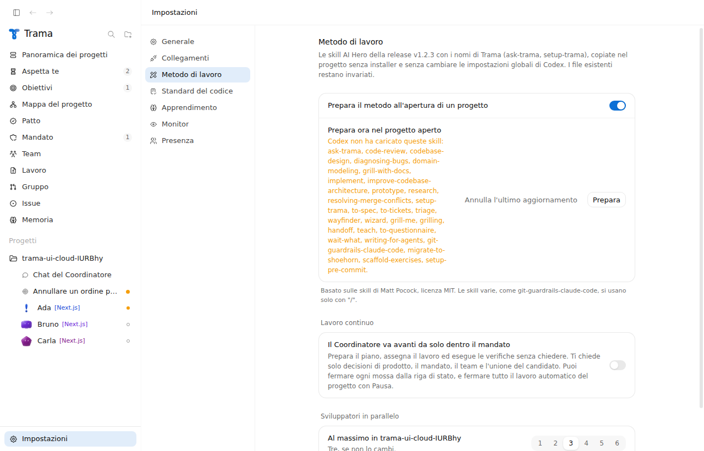 | 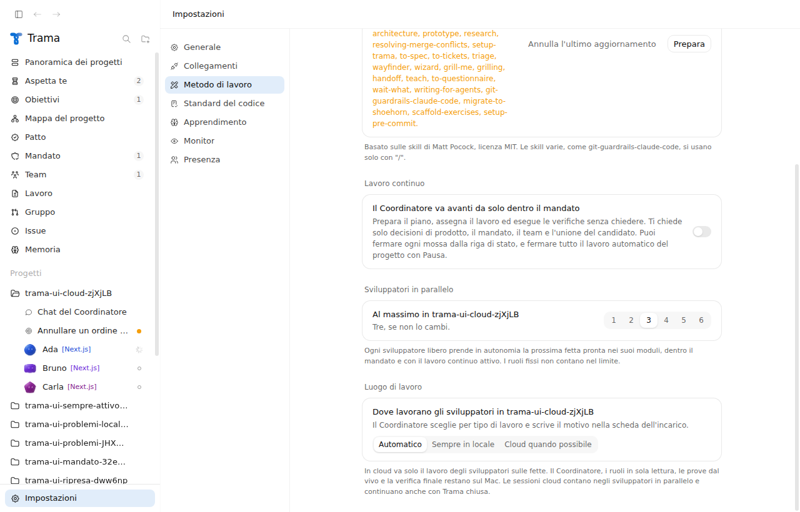 |
| Impostazione, scuro | 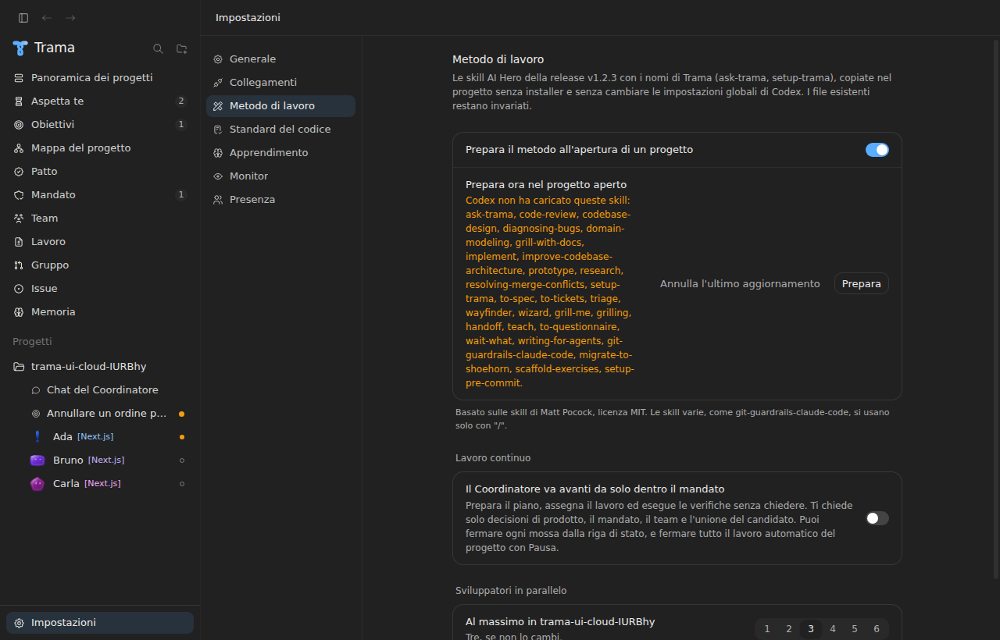 | 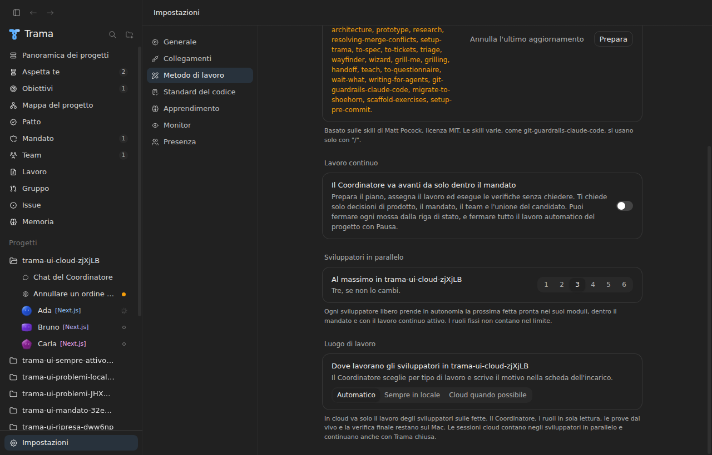 |
| Sessione al lavoro, chiaro | 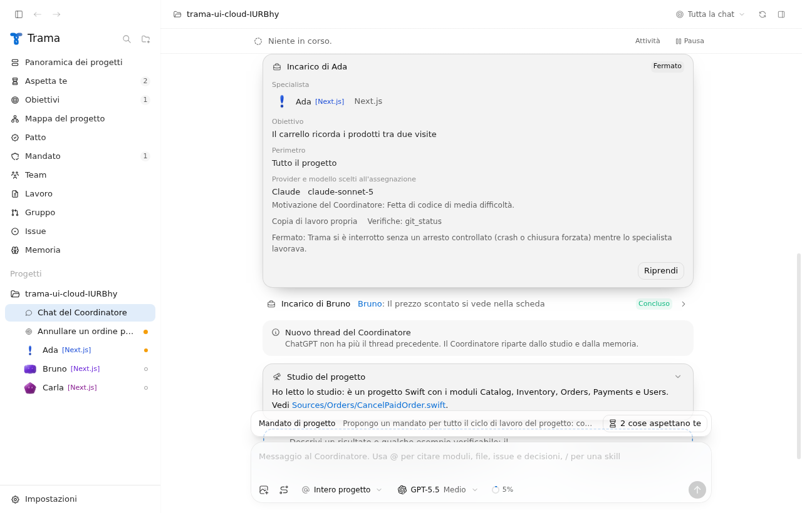 | 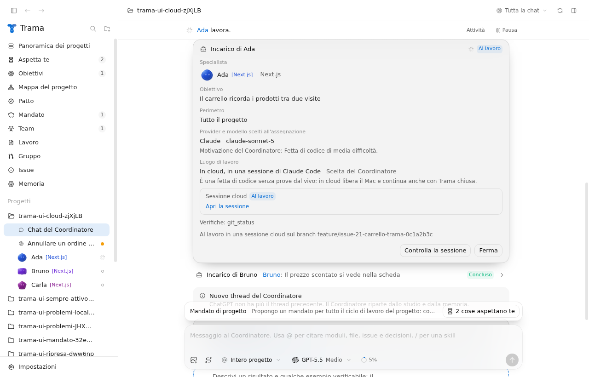 |
| Sessione al lavoro, scuro | 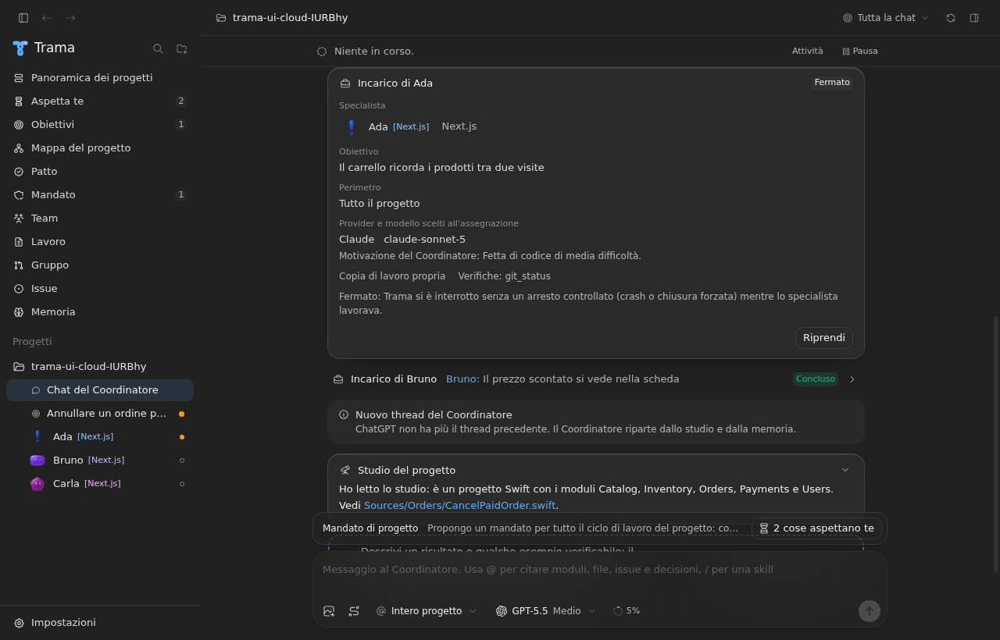 | 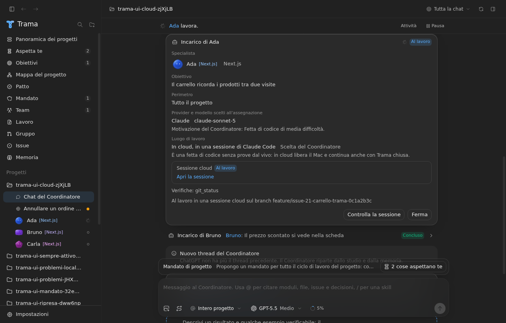 |
| Sessione tornata sul Mac, chiaro | 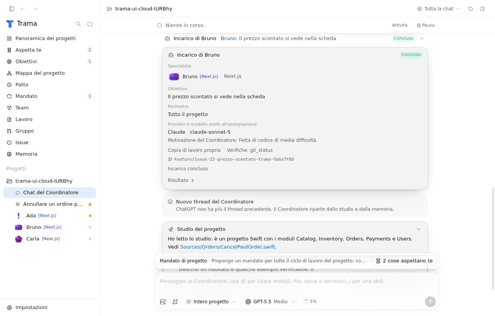 | 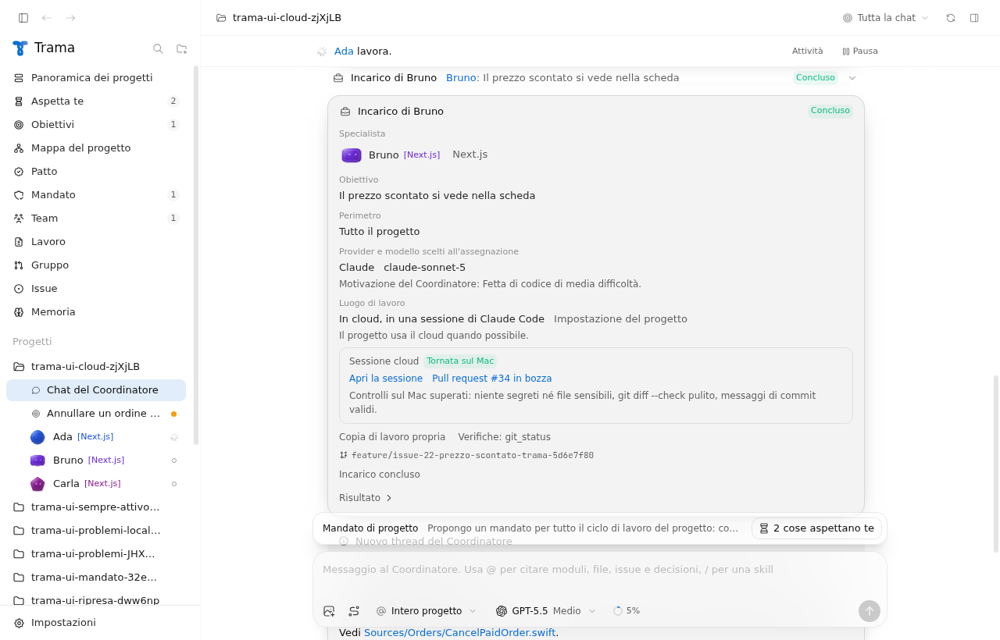 |
| Sessione tornata sul Mac, scuro | 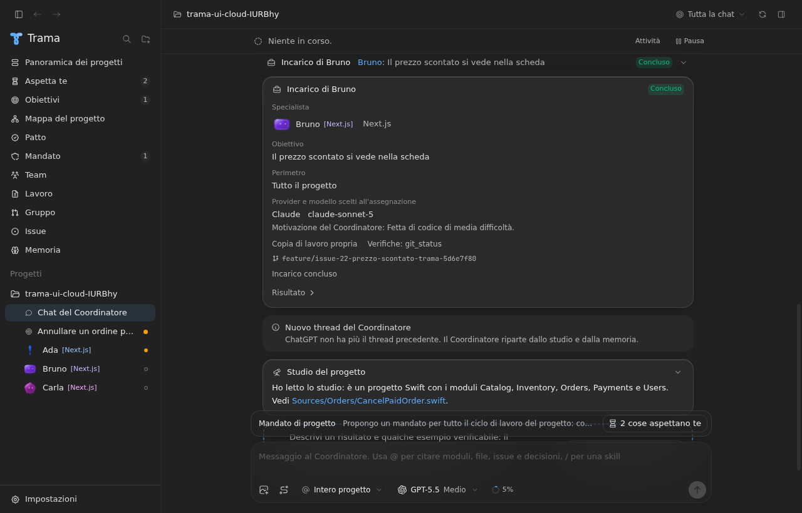 | 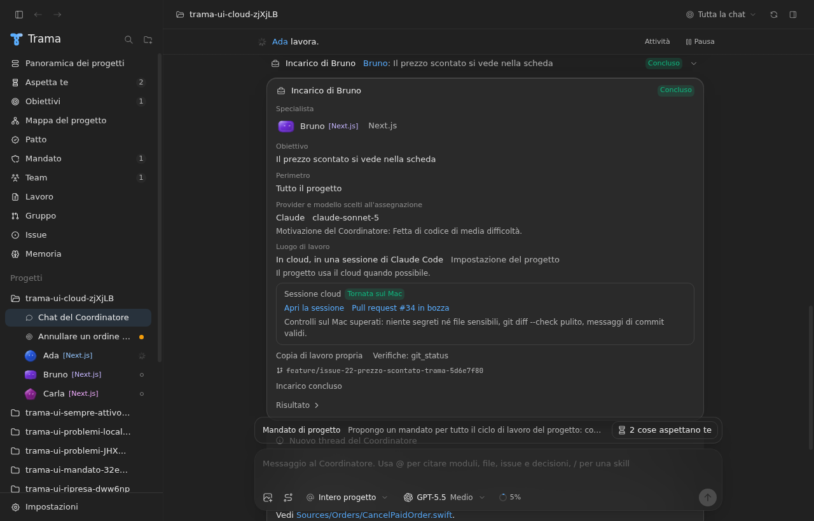 |
| In locale con il motivo, chiaro | 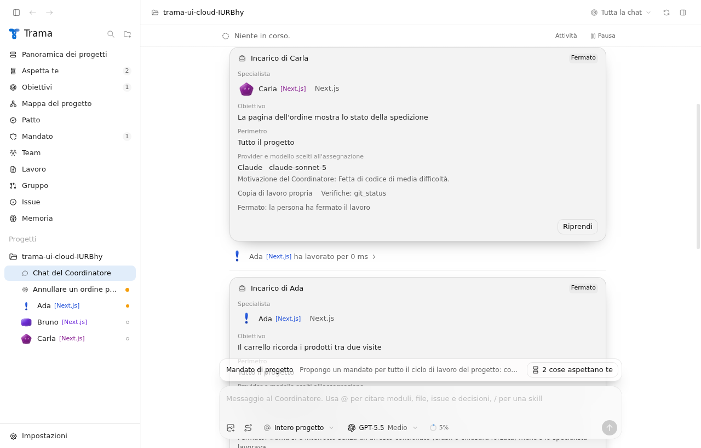 | 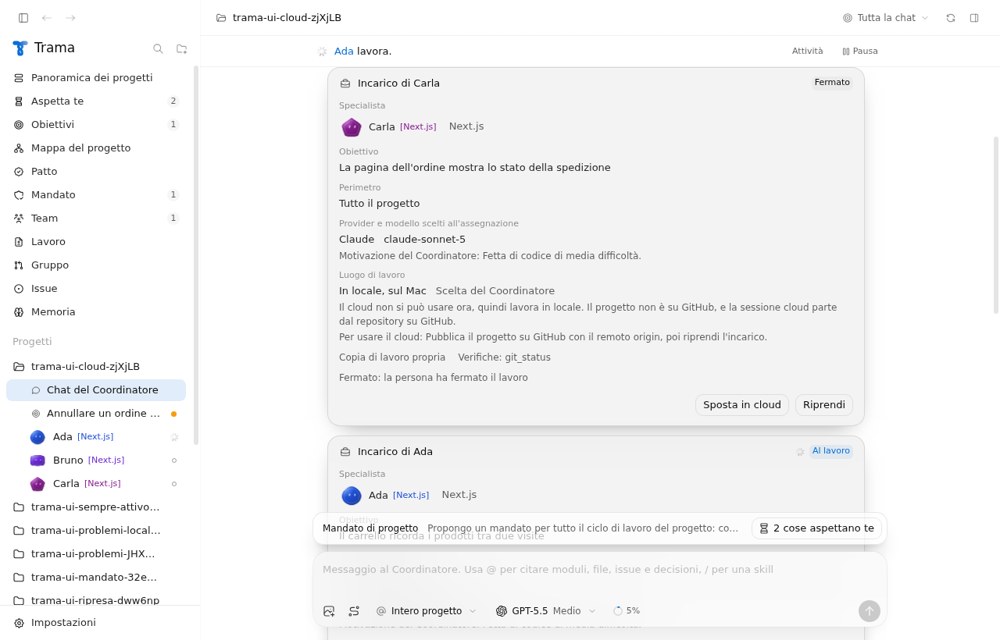 |
| In locale con il motivo, scuro | 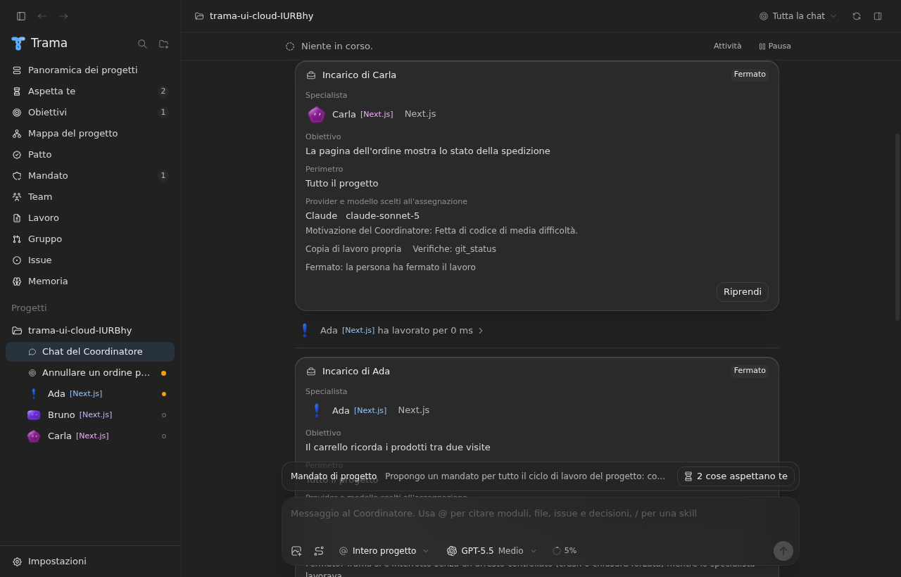 | 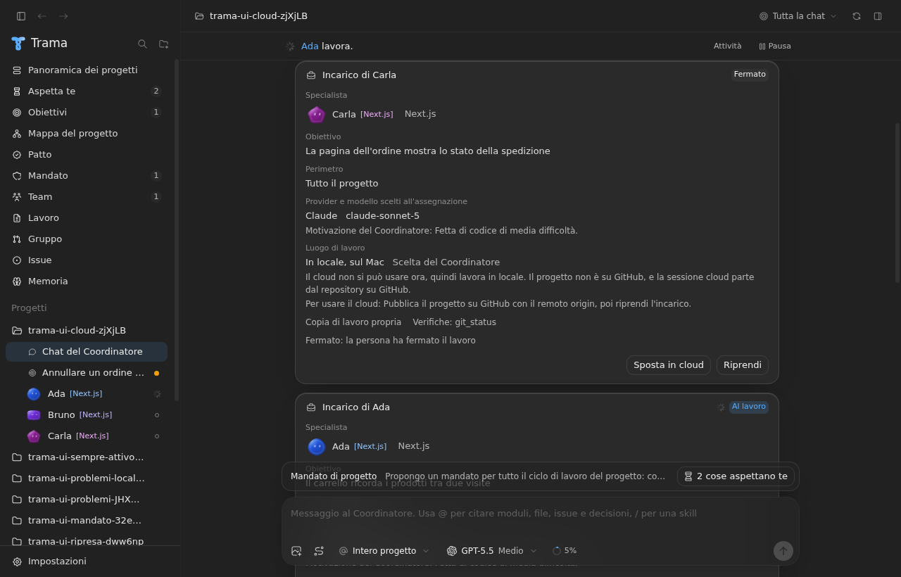 |

## Limiti

- Nessuna prova reale con una sessione cloud di Claude Code. Il comando `claude --cloud` e il link `https://claude.ai/code/session_...` seguono la documentazione di Claude Code; Trama chiude il proprio processo quando il link compare, e la sessione continua sui server del provider.
- La raccolta dei risultati alla riapertura c'è già qui; la issue #265 la completa.
- Claude Code non espone un comando per leggere lo stato di una sessione cloud: Trama la segue tramite la pull request del suo branch su GitHub. Finché la pull request non esiste la scheda dice "Al lavoro".
- Il modello della sessione cloud lo sceglie Claude Code: `claude --cloud` non prende il modello dell'incarico.
- Le istruzioni successive del Coordinatore alla sessione (riallinea, correggi la CI, rispondi alla revisione, Q26) non sono in questa fetta: l'incarico registra solo le istruzioni di apertura. Sono la issue #264.
- Codex Cloud (Q25 per Codex) non è in questa fetta: con Codex l'incarico gira in locale e la scheda lo dice. È la issue #263.
- La condizione "file necessari solo sul Mac" riconosce i file `.env` ignorati da git nella cartella del progetto, non altri file locali.
