# B02: entrata, benvenuto e scelta del progetto (26 settembre 2026)

Verifiche eseguite su Linux, in un container senza Codex reale e senza `gh`, sul branch `feature/issue-200-launch-welcome` con `origin/main` a `1bc0a45`. Le schermate vengono da `scripts/ui-check.mjs` con l'app-server Codex di prova.

## Cosa è stato provato

- Test di unità: `shared/onboarding.test.ts` (prima apertura, schermata iniziale, passi della configurazione, ripresa, scelta del metodo AI Hero, lettura del repository da clonare, stato dei progetti recenti), `renderer/lib/launchIntro.test.ts` (durata sotto 1,5 secondi, chiusura appena l'app è pronta, movimento ridotto), `main/core/overview.test.ts` (colleghi attivi ricalcolati al momento della lettura).
- ui-check: l'entrata si chiude da sola entro 1,5 secondi dal benvenuto; i fotogrammi sono presi rigiocando l'animazione e fermandola a tempi fissi; con `prefers-reduced-motion` l'entrata non ha animazioni. Il benvenuto compare al primo avvio, i tre passi hanno lo stato della guida, "Rimanda" lascia il passo saltato e la guida lo mostra, "Rivedi il benvenuto" riprende dal passo saltato. Dopo il riavvio il benvenuto non ricompare. Scelta del progetto con l'azione principale per ultima, a 1280x820 e 720x640, in chiaro e in scuro, senza scorrimento orizzontale; recenti con percorso, ultimo lavoro, stato e colleghi attivi; clonazione con un indirizzo non valido rifiutato; l'esempio si apre con l'esercizio. Cambiare progetto non rigioca l'entrata.

## Non verificato

- La clonazione reale da GitHub, con `gh` e con `git`: nel container non c'è rete verso GitHub né `gh`.
- L'accesso reale a Codex o a un altro provider dal passo del benvenuto.

## Schermate

Entrata, tema chiaro:

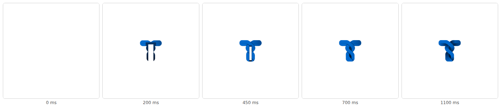

Entrata con i temi scuri di Claude e Codex, e con il movimento ridotto:

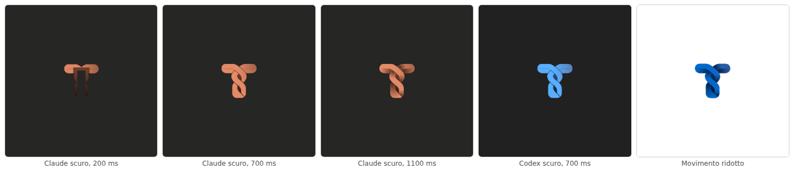

Benvenuto:

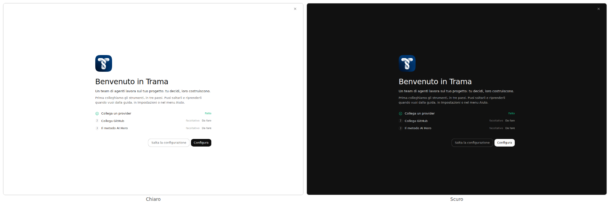
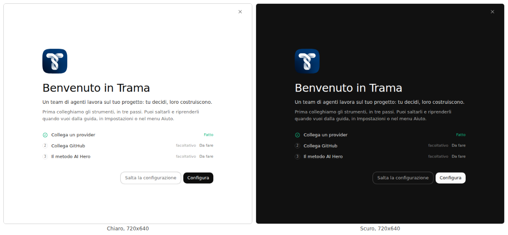

Passi della configurazione:

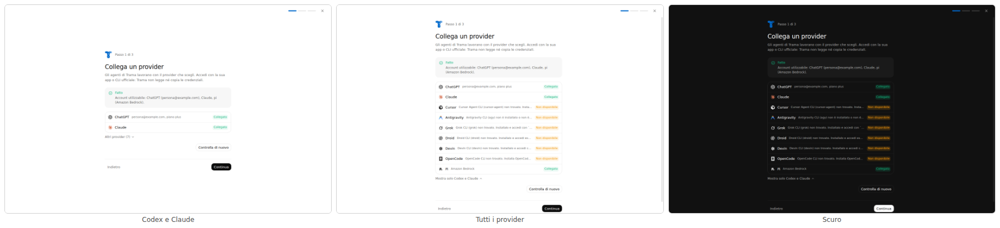
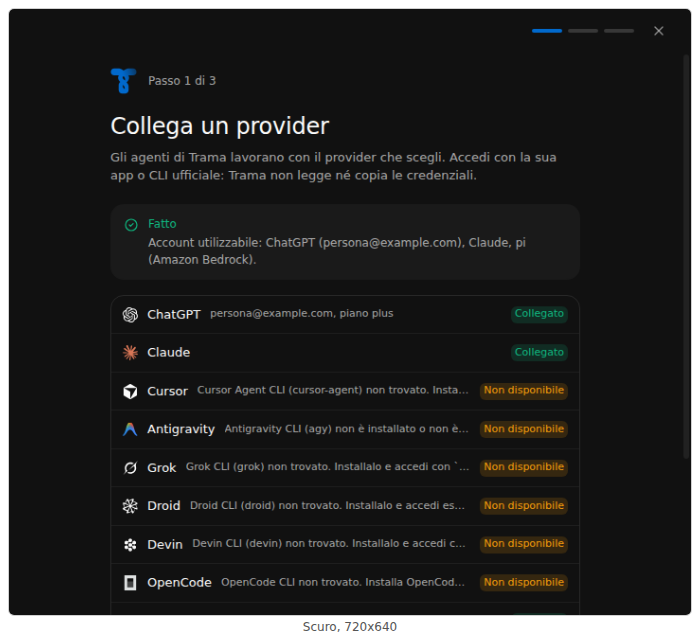
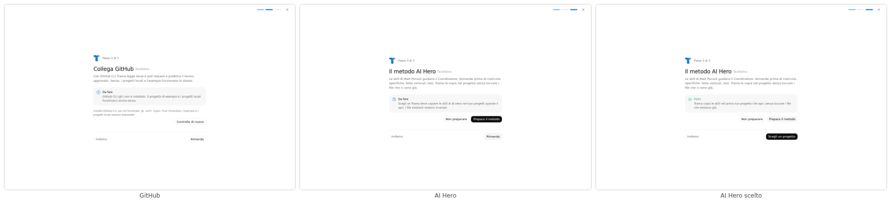
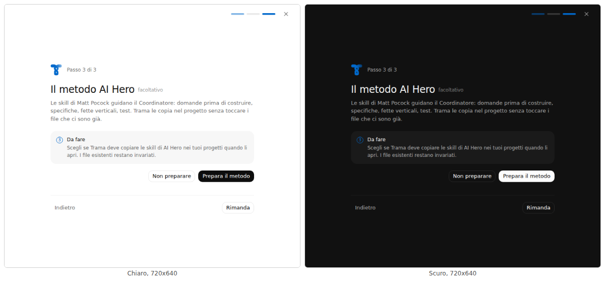

Scelta del progetto:

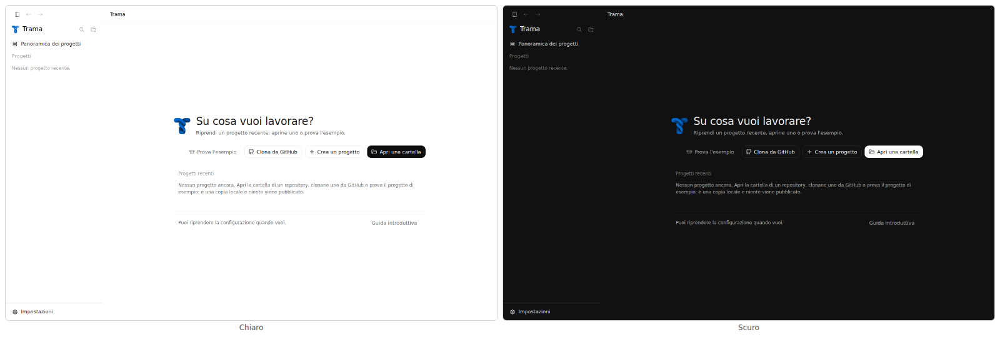
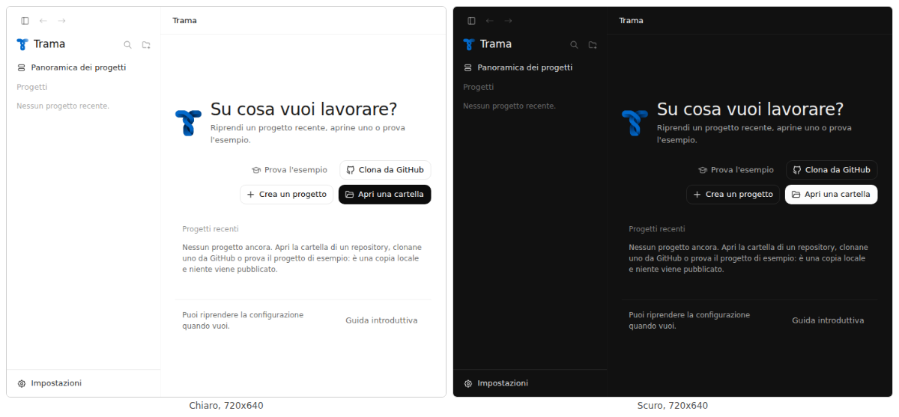
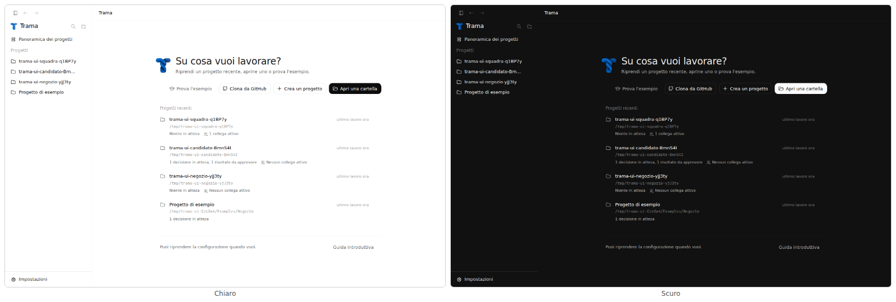
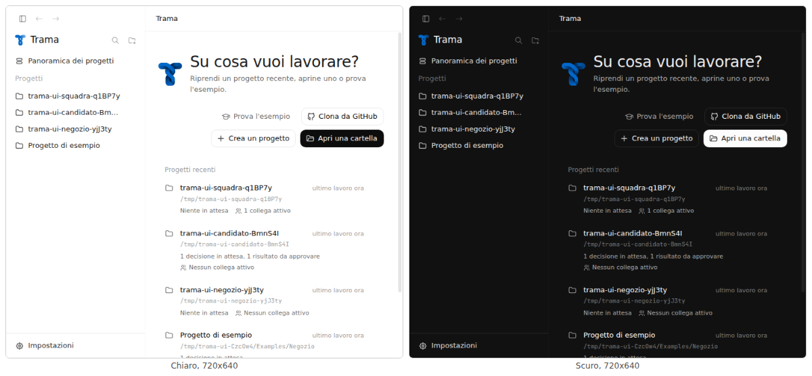
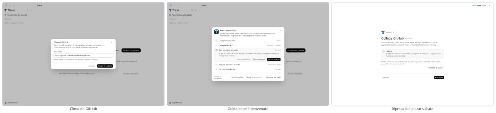
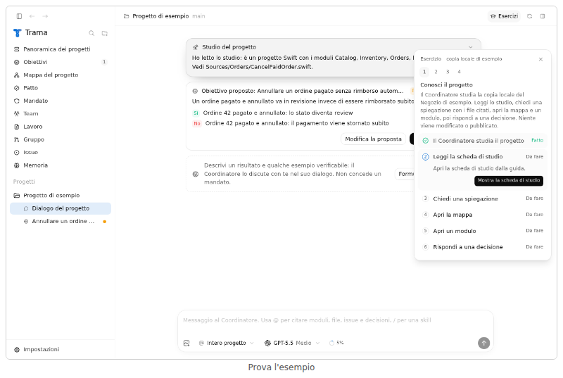
