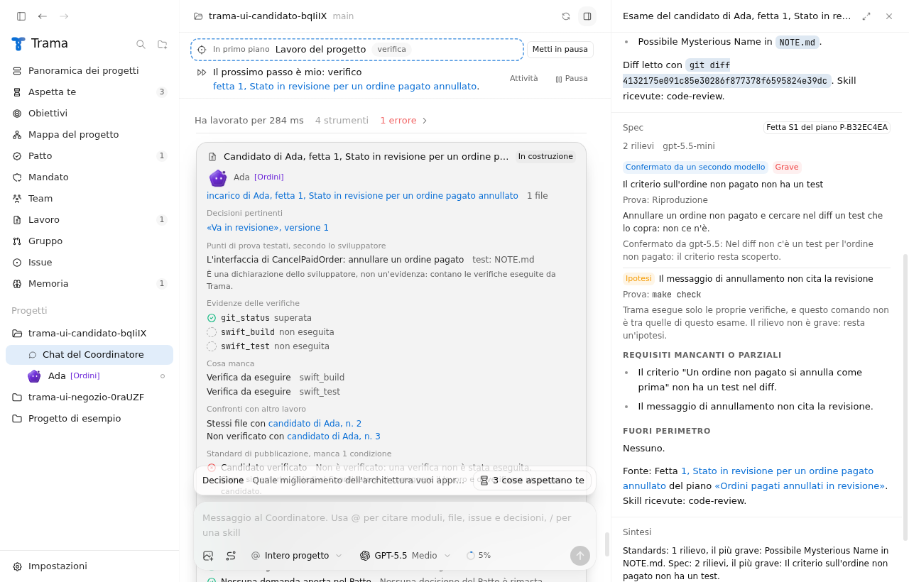
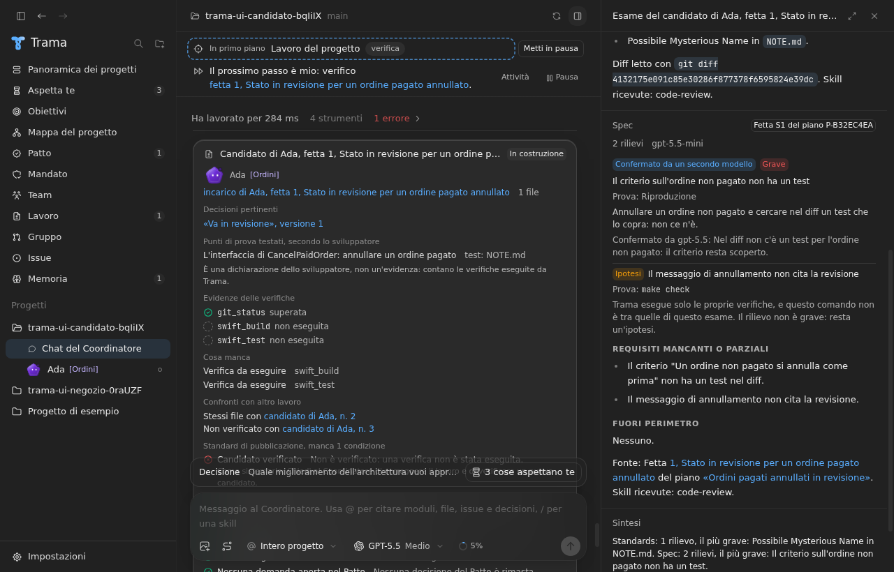
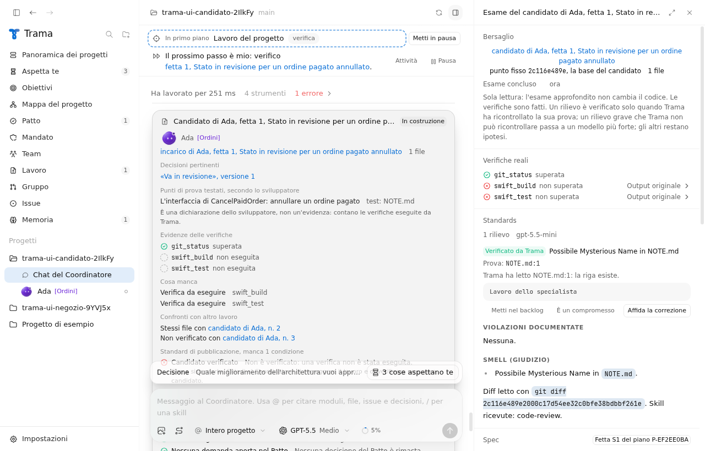
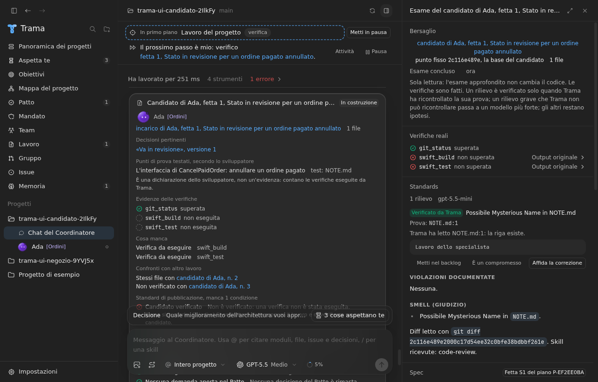
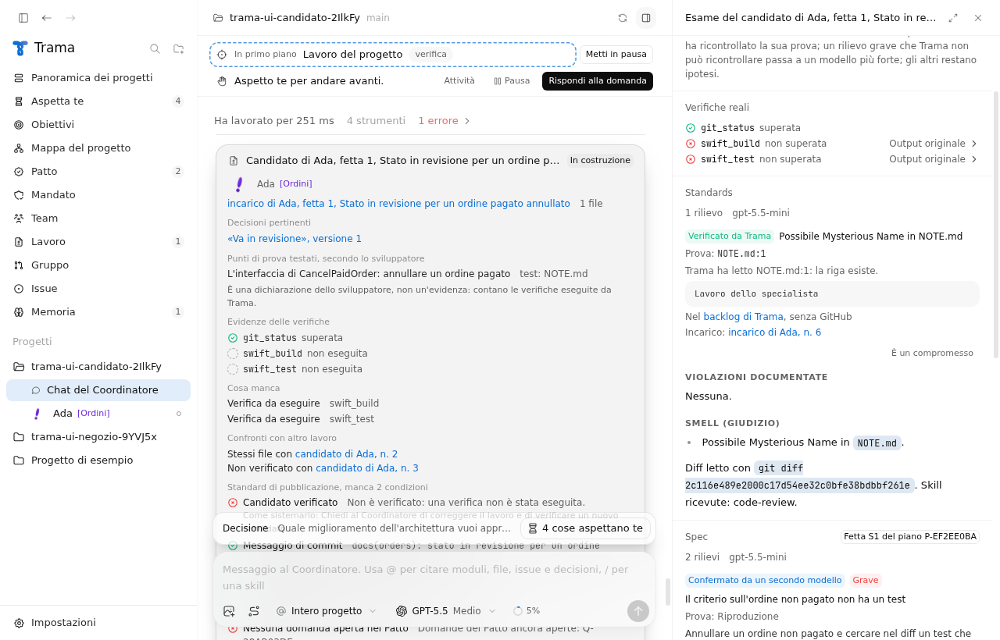
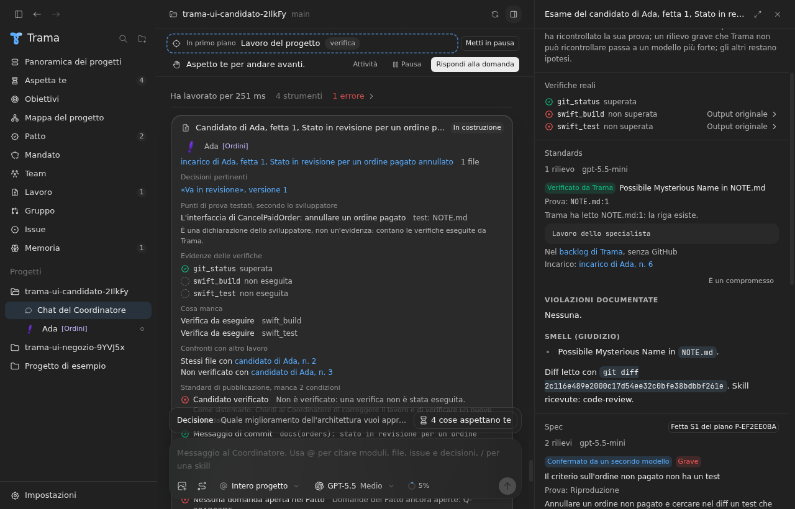

# F04: dal rilievo alla issue, all'incarico o alla scheda del Patto

Data: 28 settembre 2026. Issue #128, specifica #124. Base: `origin/main` BASE_SHA.

## Cosa è stato verificato

Tutte le prove usano il Codex finto (`app/test-fixtures/fake-codex.mjs`) e la GitHub CLI finta (`app/test-fixtures/fake-gh.mjs`). Nessuna esecuzione reale di Codex, nessuna chiamata a GitHub.

RESULTS

## Comportamento

- Da un esame approfondito concluso ogni rilievo offre fino a tre azioni, a destra: "Apri una issue" (o "Metti nel backlog" senza GitHub), "È un compromesso" e, solo per un rilievo verificato o confermato, "Affida la correzione". Ogni azione vale una volta per rilievo; sotto il rilievo resta il collegamento a ciò che è nato.
- Issue: con GitHub collegato Trama apre una issue con il titolo del rilievo, il suo stato, la prova, la riga letta da Trama e l'etichetta di triage "da valutare" del repository. Il rilievo entra nel registro dei problemi trovati e segue la loro strada: triage, poi incarico o backlog. Senza GitHub il rilievo diventa una voce del backlog di Trama, in Attività.
- Incarico: Trama controlla il mandato con le stesse regole del resto del lavoro. Senza mandato, con il mandato revocato, senza il permesso di lavorare nelle copie di lavoro o con il modulo del rilievo fuori dal mandato non nasce nessun incarico e la persona legge il motivo. Il modulo è quello del file della prova, altrimenti quelli del lavoro esaminato. L'incarico va allo sviluppatore che ha scritto il candidato, se è libero, altrimenti a un altro sviluppatore libero che copre il modulo. Il contratto porta il rilievo, la prova e un punto di prova: il rilievo non si ripresenta. Un'ipotesi non diventa un incarico.
- Scheda del Patto: il rilievo diventa una domanda con due scelte, accettare il compromesso o correggerlo, nel dialogo del lavoro esaminato. La scheda sta in Aspetta te e la risposta è una decisione del Patto come le altre.
- Pubblicazione: il rapporto resta in Trama. Con GitHub collegato la persona può pubblicarlo: diventa un commento alla pull request aperta del candidato o, se non ce n'è una, una issue nuova. Si pubblica una volta e solo un esame concluso. Il testo nomina il candidato con il nome dello sviluppatore, non con l'id.

## Test

- `app/src/main/core/findingWork.test.ts`: issue registrata nel registro dei problemi e voce del backlog senza GitHub; testo della issue con prova, stato e nomi al posto degli id; un solo seguito per tipo; incarico all'autore del candidato sul modulo della prova e, se è occupato, a un altro sviluppatore; nessun incarico con mandato ristretto, revocato o senza il permesso di lavorare; nessun incarico da un'ipotesi o da un esame non concluso; scheda del Patto con due scelte; rapporto con le verifiche in testa e gli assi separati; destinazione della pubblicazione.
- `app/src/main/focusAudit.integration.test.ts`: con il controller, voce del backlog senza GitHub, pubblicazione rifiutata senza repository, scheda del Patto con la sua scheda in chat, incarico di correzione che parte e si conclude, nessun incarico dopo la revoca del mandato.
- ui-check: nel progetto del candidato, che non ha un remoto GitHub, le tre azioni nell'ordine giusto, nessun incarico da un'ipotesi, voce del backlog, scheda del Patto e incarico in un clic ciascuno, nessun pulsante di pubblicazione senza GitHub, in chiaro e in scuro. La issue su GitHub e la pubblicazione sono provate dai test unitari, non dall'interfaccia.

## Schermate

Prima (main) e dopo, in chiaro e in scuro, in `docs/images/f04/`.

| | Chiaro | Scuro |
| --- | --- | --- |
| Prima |  |  |
| Azioni sul rilievo |  |  |
| Dopo i tre clic |  |  |

## Limiti

- L'incarico di correzione parte da una copia di lavoro nuova del progetto: se il candidato non è ancora unito, lo sviluppatore non trova la sua modifica. Le istruzioni nominano il candidato da cui viene il rilievo.
- La risposta alla scheda del Patto non crea da sola un incarico: il Coordinatore la legge come ogni decisione.
- La vista resta nell'ispettore; la vista a tutto schermo è un altro ticket.
