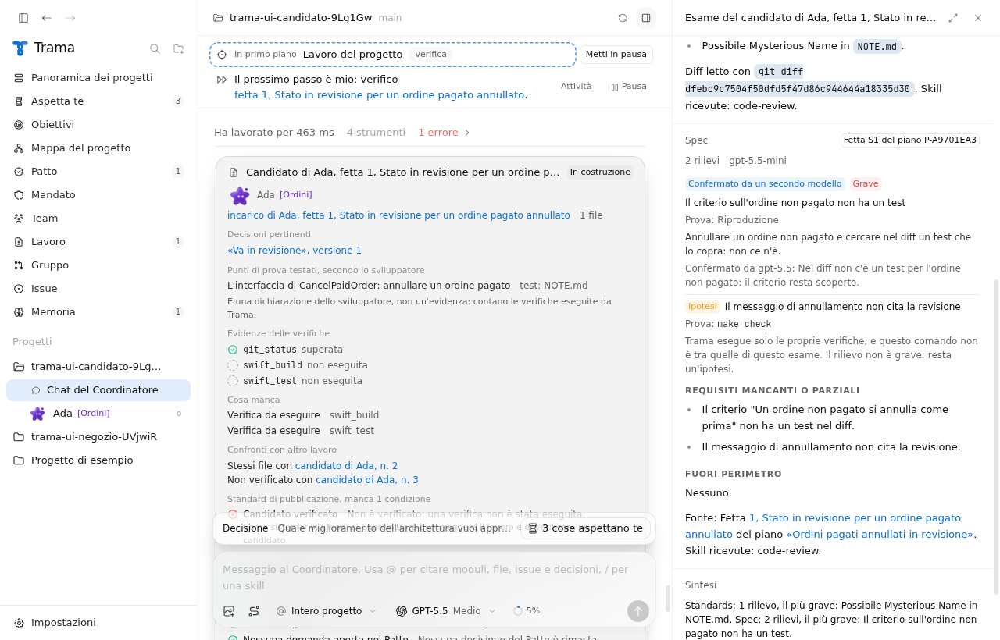
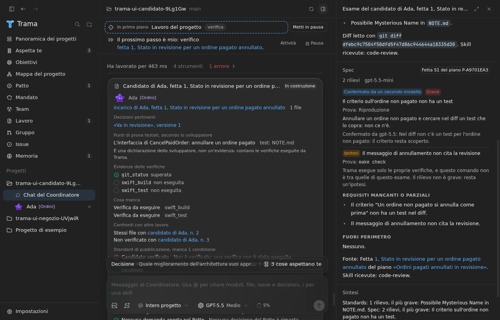
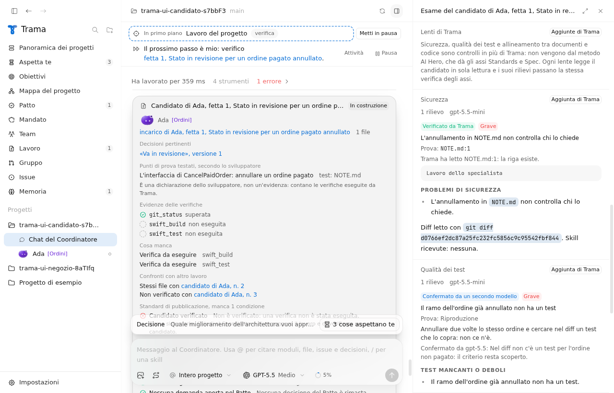
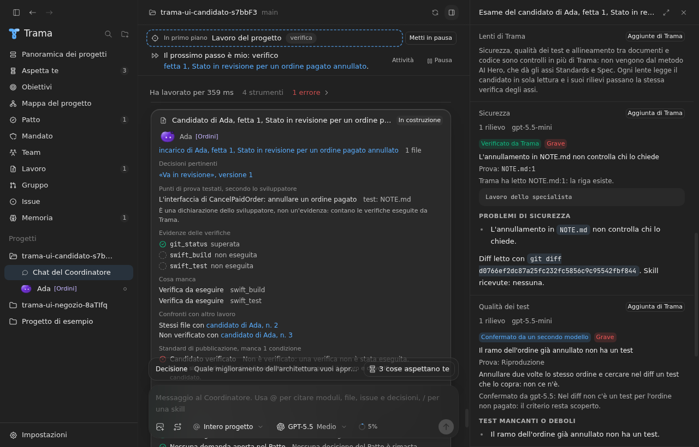

# F05: lenti di Trama nella focus mode

Data: 28 settembre 2026. Issue #129, specifica #124. Base: `origin/main` 8bf9f4a.

## Cosa è stato verificato

Tutte le prove usano il Codex finto (`app/test-fixtures/fake-codex.mjs`). Nessuna esecuzione reale di Codex.

- `npx tsc --noEmit -p .`: nessun errore.
- `npx vitest run`: 135 file, 1289 test superati, 3 saltati.
- `npm run build`: riuscito.
- `xvfb-run -a node scripts/ui-check.mjs`: una corsa completa, uscita 0. Passi nuovi: `20g-focus-audit-lenses` (chiaro) e `20h-focus-audit-lenses-dark` (scuro).

## Comportamento

- Accanto ai due assi di `code-review` (Standards e Spec) la focus mode esegue tre lenti: Sicurezza, Qualità dei test, Documenti e codice.
- Le lenti non vengono dalle skill di AI Hero. Il loro compito è scritto da Trama (`LENS_BRIEFS` in `app/src/main/core/audit.ts`) e non contiene il testo di una skill. L'interfaccia le raccoglie sotto "Lenti di Trama" e segna ognuna come "Aggiunta di Trama".
- Ogni lente è una sessione in sola lettura ed effimera nel worktree del candidato. Parte dopo le verifiche reali, insieme agli assi, sullo stesso modello leggero.
- Le lenti danno i rilievi con la stessa prova degli assi (`file:riga`, comando, riproduzione) e passano la stessa verifica di F02: Trama ricontrolla le prove che può eseguire, un rilievo grave che Trama non può ricontrollare va al modello più forte, il resto resta un'ipotesi.
- La sintesi della skill resta quella dei due assi. Le lenti hanno una riga propria, "Lenti di Trama: ...". Il conteggio "Stato dei rilievi" comprende anche i rilievi delle lenti.
- L'esame fallisce solo se nessuna sessione, asse o lente, ha prodotto un rapporto. Un esame salvato prima delle lenti si riapre senza lenti.
- I testi nuovi dell'interfaccia stanno nel catalogo delle traduzioni, in italiano e in inglese. Il rapporto di una lente è nella lingua scelta dalla persona.

## Test

- `app/src/main/core/audit.test.ts`: turno di ogni lente con il compito di Trama, senza skill e senza il testo di `code-review`; avvio delle tre lenti accanto agli assi; riga di sintesi delle lenti; chiusura con il solo rapporto di una lente; interruzione con i rilievi in attesa che diventano ipotesi; esame salvato prima delle lenti; lingua inglese nel turno e nella sintesi.
- `app/src/main/core/auditFindings.test.ts`: i rilievi delle lenti finiscono verificati, confermati o ipotesi come quelli degli assi; il secondo modello legge che il rilievo viene da una lente di Trama.
- `app/src/main/focusAudit.integration.test.ts`: con il controller, cinque sessioni distinte (due assi e tre lenti), tutte aperte dopo le verifiche; le lenti non ricevono skill; il rilievo di sicurezza con `file:riga` è verificato, quello sui test con una riproduzione è confermato da `gpt-5.5`, quello sui documenti senza prova resta un'ipotesi.
- ui-check: nota "Lenti di Trama", tre segni "Aggiunta di Trama", i tre stati nelle lenti, l'ordine assi, lenti, sintesi, la riga delle lenti e il conteggio complessivo, in chiaro e in scuro.

## Schermate

Prima (`origin/main` 7e13d3f, dopo l'asse Spec viene la sintesi):

Dopo (le lenti di Trama dopo gli assi):

## Limiti

- La vista resta nell'ispettore; la vista a tutto schermo è un altro ticket (#127).
- Le tre lenti partono sempre. La persona non può ancora sceglierne solo alcune.
- Un rilievo di una lente è un giudizio del modello come quelli degli assi: "Verificato da Trama" dice che la prova regge, non che il giudizio sia giusto.
