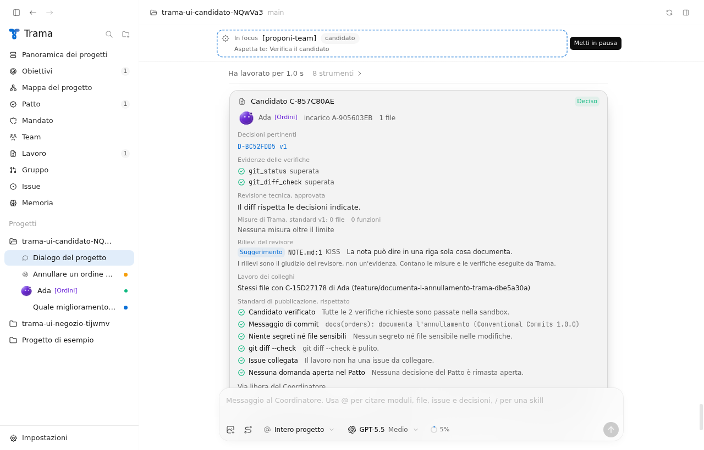
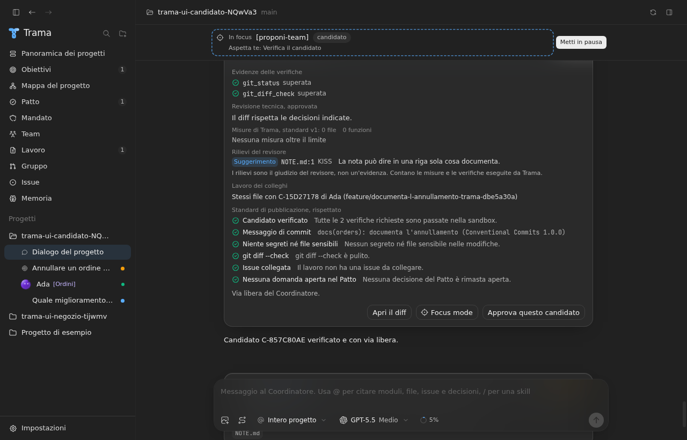
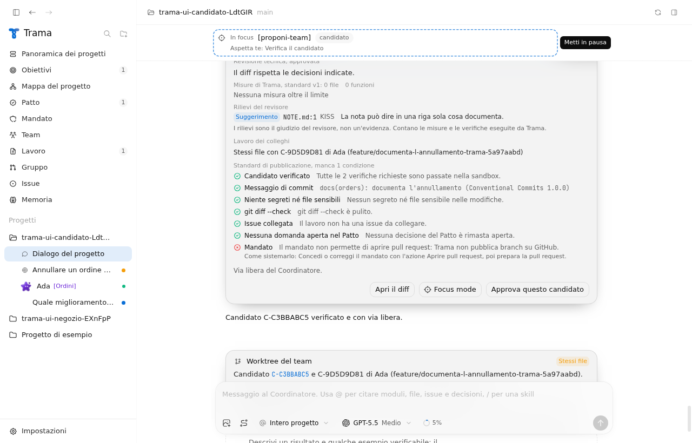
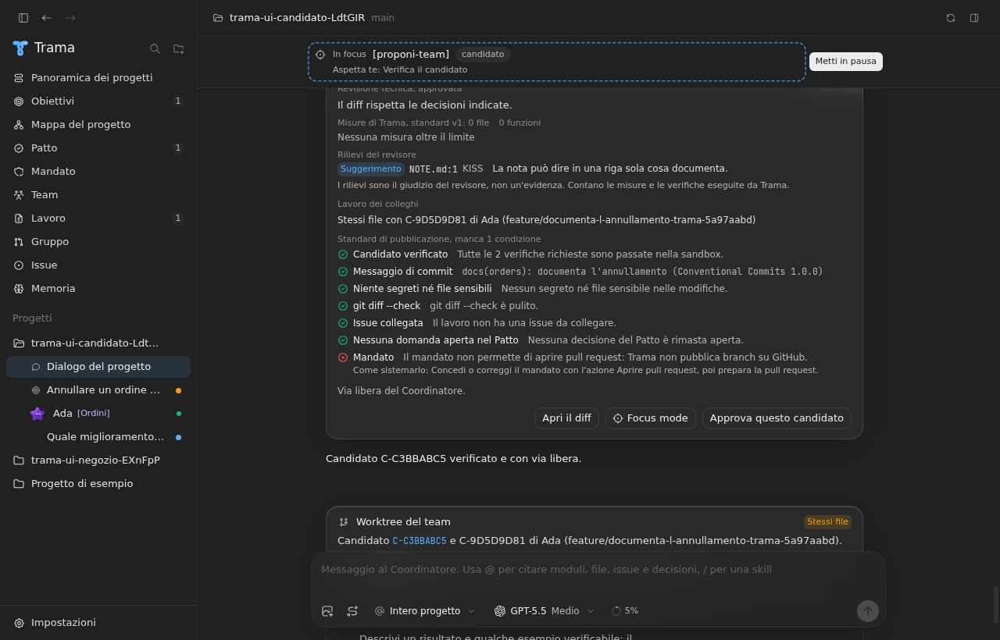
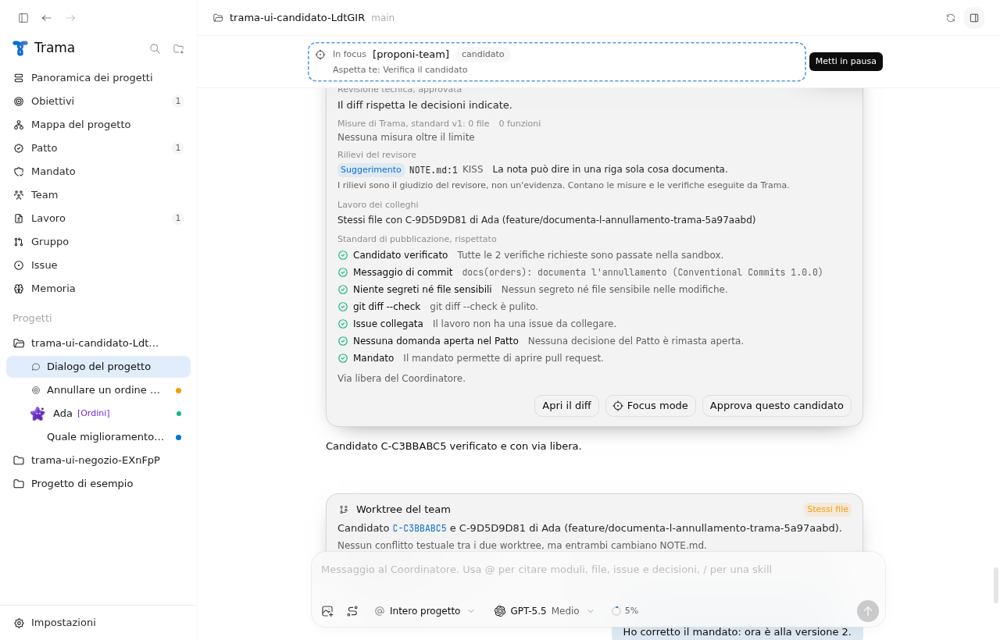
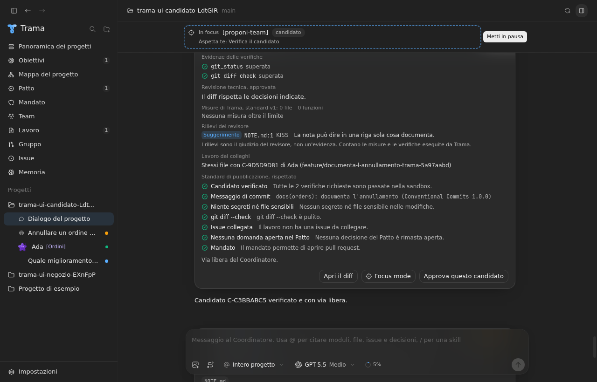

# Verifica issue #273: nessun push fuori mandato

Data: 2026-09-27. Registro delle verifiche eseguite su questa correzione.

## Percorso del push, ricostruito dal codice

- Pubblicazione del candidato (`publishCandidate`): faceva `git push -u origin <branch>` senza guardare il mandato. L'evento restava nella conversazione solo se anche la pull request veniva creata. Se `gh` falliva dopo il push, il branch restava sul remoto senza pull request e senza traccia. È il solo percorso nel codice che pubblica un branch, e corrisponde a quanto descritto nella issue: un branch del candidato sul remoto, con un mandato che non permette pubblicazioni.
- Presenza (ADR 0015): scrive solo `refs/trama/presence/<utente>` da una cache separata, mai un branch.
- Provider e agenti: Codex e Claude lavorano senza rete; Pi, OpenCode, Antigravity e gli agenti ACP non hanno una shell. Nessun agente può pubblicare.
- Coordinatore: nessuno strumento del Coordinatore pubblica un candidato.

Gli eventi del progetto sul Mac del coordinatore non sono stati letti qui: la ricostruzione viene dal codice e dai test.

## Cosa cambia

- Ogni push di un branch passa da `pushBranch`, che richiede un mandato concesso con l'azione Aprire pull request, anche quando la persona preme Pubblica.
- Ogni push resta nella conversazione: fermato dal mandato, avviato, riuscito o non riuscito.
- Lo standard di pubblicazione ha una nuova condizione, Mandato: la scheda del candidato dice perché non si può pubblicare e come sistemarlo, e il pulsante Prepara la pull request non compare.
- Un `git push` di un agente Claude viene rifiutato; ogni tentativo di push di un agente viene registrato come errore.
- Un test legge il codice sorgente e fallisce se un file diverso da `push.ts` esegue un push, o se la presenza scrive fuori dai propri riferimenti.

## Test

- `publication.test.ts`: senza mandato, con un mandato che vieta le pubblicazioni, con uno che permette solo il worktree e con uno revocato, il remoto resta senza branch, non c'è commit e resta un solo evento di rifiuto. Con il mandato giusto il push viene registrato prima e dopo, anche quando poi la pull request fallisce.
- `push.test.ts`: rifiuto senza eseguire git, registrazione di push riusciti e non riusciti, riconoscimento dei comandi `git push`, rifiuto per gli agenti Claude, controllo del codice sorgente.
- `team.integration.test.ts`: con un remoto GitHub e un mandato senza pull request, la pubblicazione chiesta dalla persona viene fermata e registrata.
- `ui-check`: la scheda del candidato mostra la condizione Mandato non rispettata, poi rispettata dopo la correzione del mandato, in chiaro e in scuro.

## Schermate

Prima: il candidato rispetta lo standard anche se il mandato non permette pull request.

Dopo: il mandato ferma la pubblicazione e la scheda dice come sistemarlo.

Dopo la correzione del mandato con Aprire pull request.

