# U03: scheda del mandato, 27 settembre 2026

Issue #268, dall'audit #262 sezione 5.

## Il problema

Una proposta di mandato non diceva cosa cambiava rispetto al mandato in vigore. Il pulsante Revoca sulla proposta revocava l'intero mandato attivo e fermava il lavoro fuori perimetro. Priorità e limiti erano uniti con una virgola.

## Cosa fa ora Trama

- Se c'è un mandato in vigore, la scheda di una proposta mostra cosa aggiunge e cosa toglie (perimetro, azioni, obiettivi, priorità, limiti) e i lavori in corso che si fermerebbero.
- I pulsanti della proposta sono Rifiuta la proposta, Correggi e Concedi, a destra con la primaria per ultima.
- Rifiuta la proposta chiede un motivo e usa `mandate:reject`: la richiesta diventa «Rifiutata», il mandato in vigore resta com'è e nessun lavoro si ferma.
- La revoca del mandato in vigore sta solo nella vista Mandato. Chiede il motivo e mostra una conferma con i lavori che si fermano.
- Obiettivi, priorità, perimetro, azioni e limiti sono elenchi puntati.

I lavori che si fermerebbero vengono dallo stesso calcolo che il controller usa quando ferma il lavoro (`app/src/shared/mandate.ts`).

## Verifiche eseguite

Su origin/main `8fb058a`, in `app/`:

- `npx tsc --noEmit -p .`: nessun errore.
- `npx vitest run`: 106 file, 937 test passati, 3 saltati.
- `npm run build`: riuscito.
- `xvfb-run -a node scripts/ui-check.mjs`: uscita 0. Il controllo nuovo verifica la differenza, l'ordine dei pulsanti, l'assenza di Revoca sulla proposta, il motivo obbligatorio della revoca e che il rifiuto lasci il mandato uguale.

Le schermate «prima» vengono da ui-check su origin/main `2257d52`, allo stesso punto del percorso. Nessuna prova con Codex reale.

## Schermate

Prima: la proposta nella vista Mandato e il pulsante Revoca sulla proposta, che revocava il mandato in vigore.

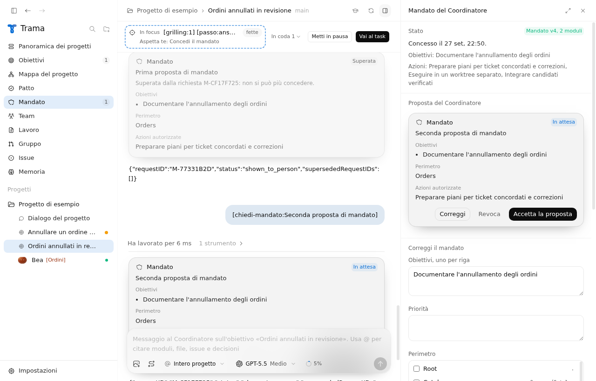
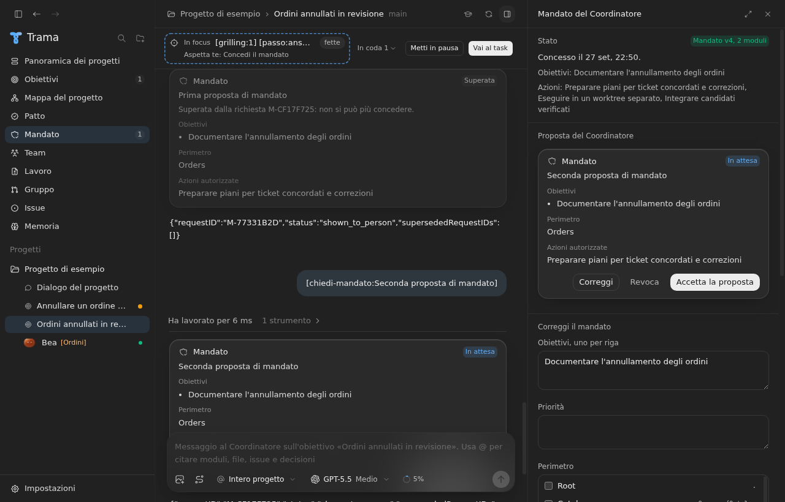
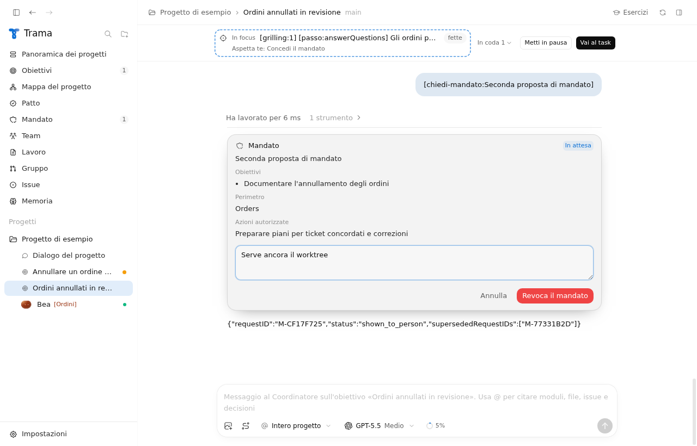
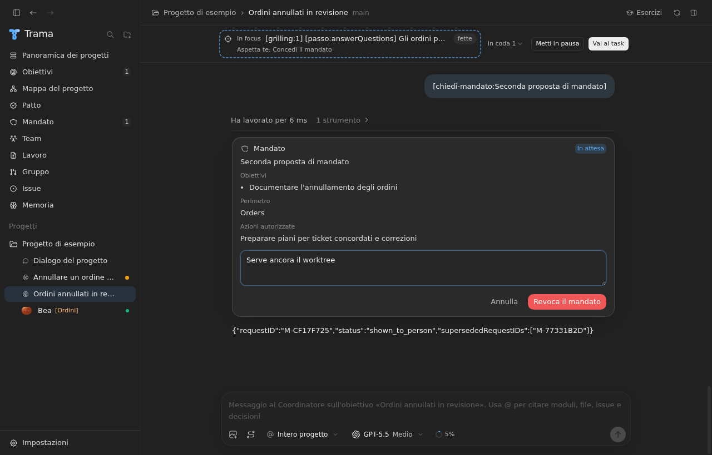

Dopo: la scheda con la differenza, la vista Mandato, la conferma della revoca e la proposta rifiutata.

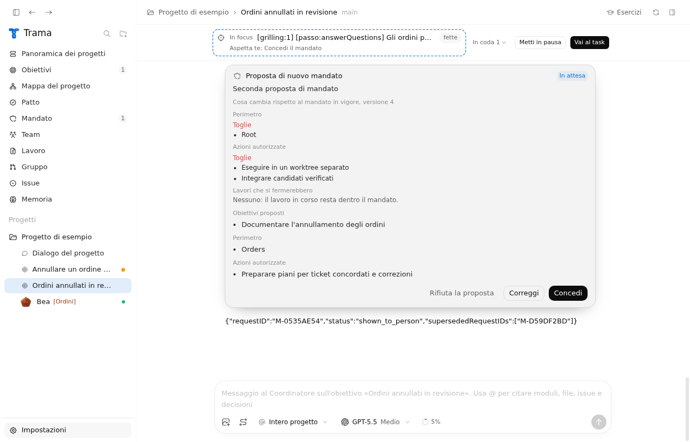
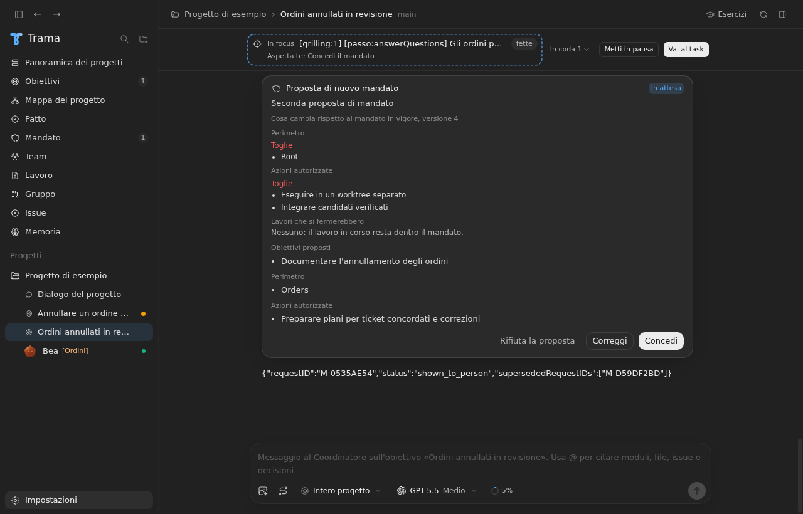
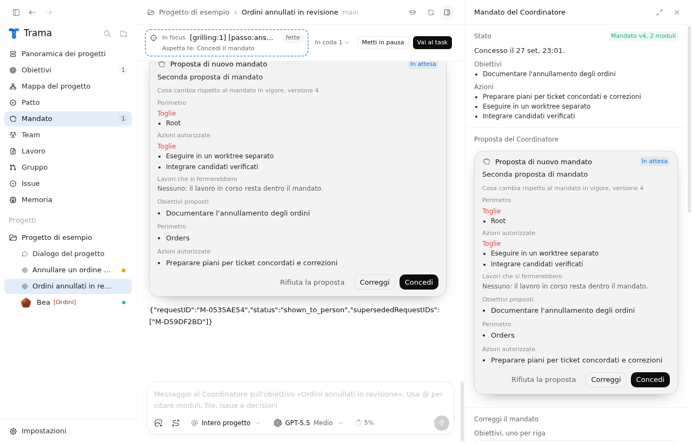
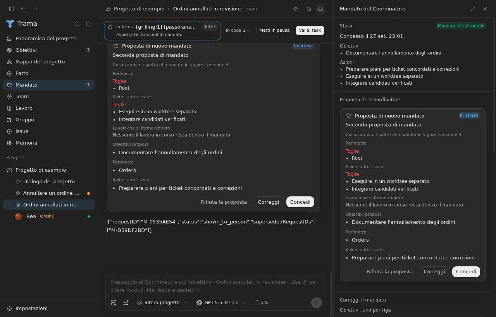
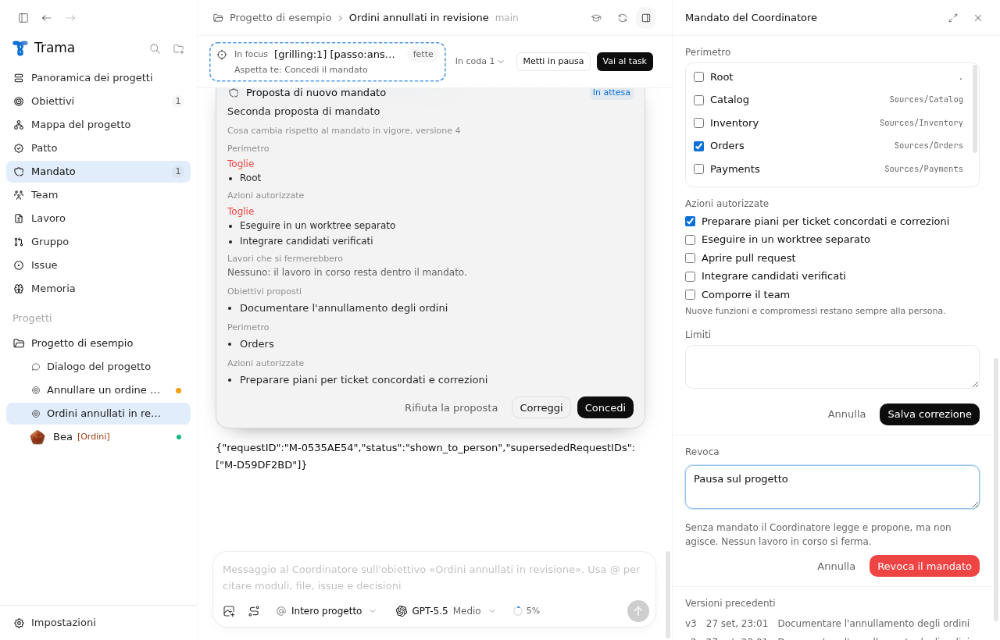
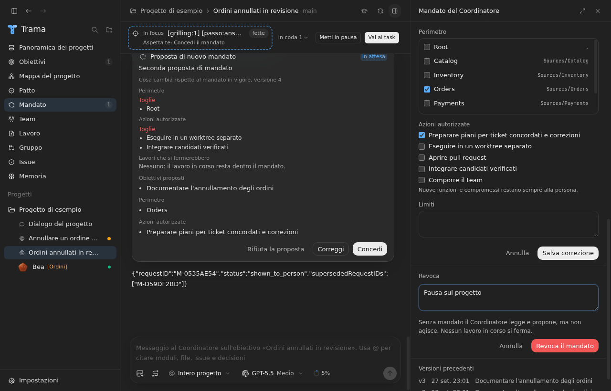
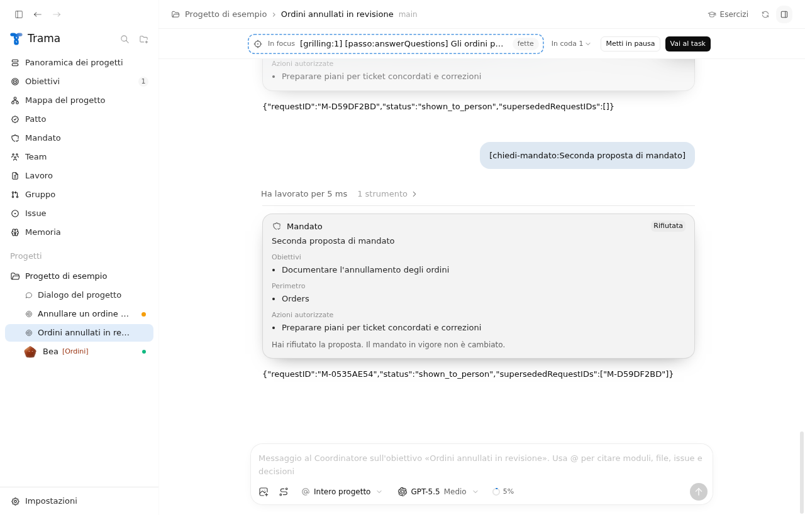
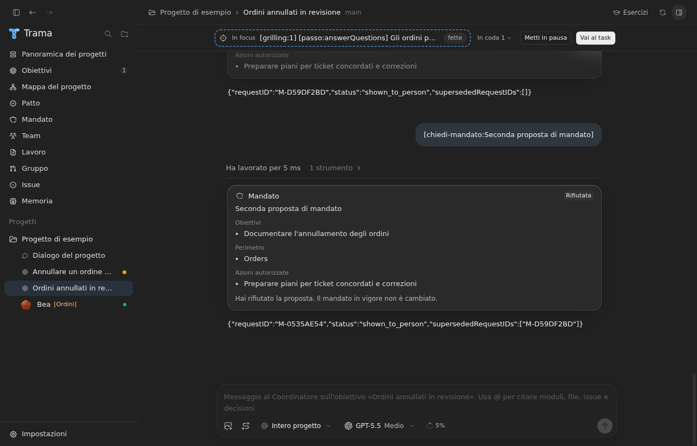
