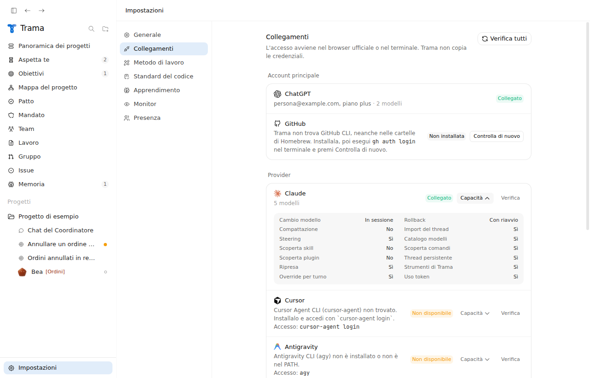
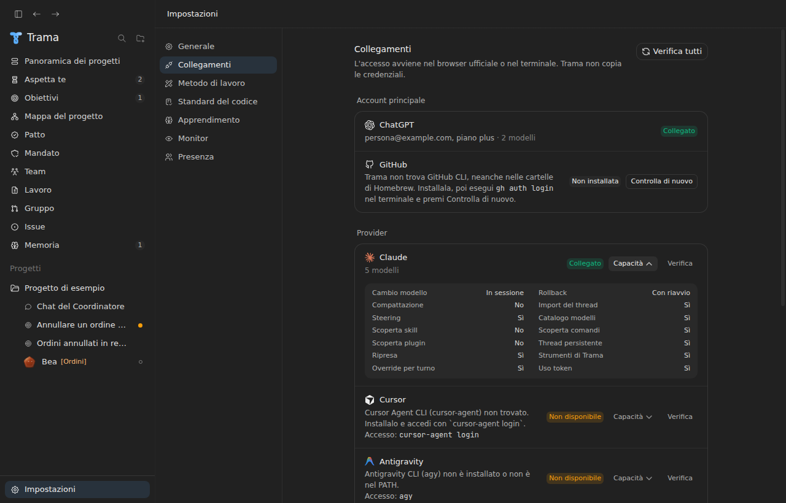
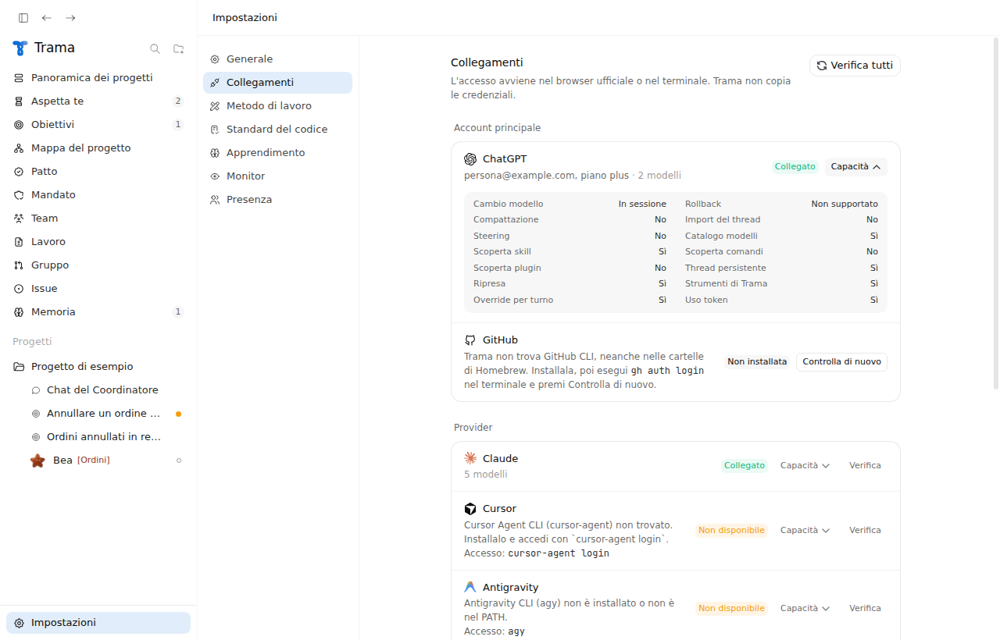
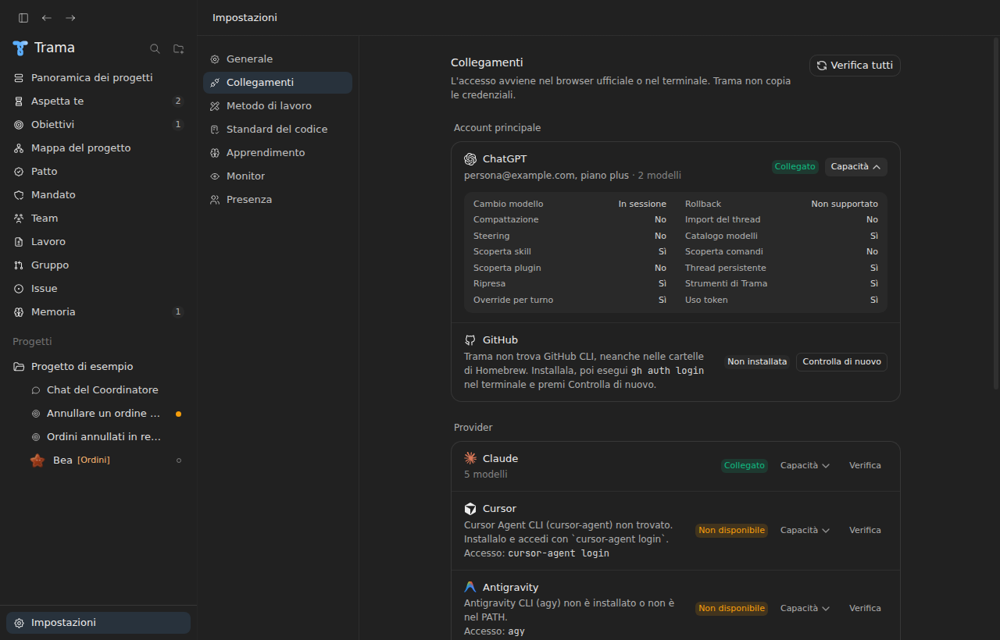

# V08 - Forma dell'adattatore provider, verifica sull'app Electron

Ticket: #71. Questa nota sostituisce, per lo stato attuale, quella del 18 settembre (`v08-adattatore-provider-2026-09-18.md`), scritta per i sorgenti SwiftUI poi rimossi (ADR 0011). Oggi Trama ha nove adattatori in TypeScript (ADR 0012), non uno solo: la parte del ticket su "Codex unico adattatore" è superata.

## Cosa cambia con questa modifica

- `app/src/shared/providers.ts`: il catalogo usa `ProviderId` per l'identificativo. Le capacità descrivono cosa fa Trama con il provider, non tutto quello che offre la sua CLI. Rollback, steering, compattazione, import del thread, scoperta di comandi e plugin sono spenti per tutti, perché nessun adattatore ha il metodo. La scoperta di skill resta solo per ChatGPT, che ha `listSkills`.
- `app/src/main/core/providers/conformance.ts`: il controllo di conformità. Lega ogni capacità al metodo che la realizza (`listModels`, `openThread`, `listSkills`, `listCommands`, `listPlugins`, `steerTurn`, `compactThread`, `importThread`, `rollbackThread`, oppure `stop` e `openThread` per il rollback con riavvio) e segnala anche il caso opposto: un metodo presente con la capacità spenta.
- `app/src/main/core/providers/registry.ts`: una fabbrica per ciascuno dei nove provider, obbligatoria per tipo.
- `app/src/main/core/providers/types.ts`: `listSkills` entra nella forma comune come metodo facoltativo.
- `app/src/renderer/components/settings/SettingsView.tsx`: in Collegamenti la riga di ChatGPT ha lo stesso pannello Capacità degli altri provider.

## Stato dei criteri sul codice attuale

1. Interfaccia comune: fatto. `AgentRuntime` in `providers/types.ts` con conto, modelli, accesso, sessione, turno, interruzione e arresto. Le capacità stanno nel catalogo condiviso, che anche l'interfaccia legge. Lo stato sconosciuto è l'assenza di stato prima del primo controllo e si vede come "Stato sconosciuto". I modelli e le preferenze restano separati per provider.
2. Eventi normalizzati: fatto. Ogni adattatore produce solo `TurnEvent` (`shared/codex.ts`); il controller li trasforma in eventi della conversazione e la timeline legge solo quelli. Test di mappatura per ogni adattatore.
3. Stessa forma in Collegamenti: fatto con questa modifica. Schermate sotto.
4. Capacità e controllo di conformità: fatto con questa modifica. Test in `providers/conformance.test.ts`.
5. Infrastruttura comune:
   - un solo controllo di accesso alla volta: fatto (`refreshCodex` e `providerRefreshes` in `controller.ts`, con un tempo massimo di 20 secondi);
   - stato su disco mostrato subito all'avvio e cache dei modelli su disco: superati. Dopo il 18 settembre un provider si offre solo con un accesso verificato (ADR 0008, commento sulla issue): mostrare all'avvio uno stato vecchio come "Collegato" andrebbe contro questa regola. Durante una sessione i modelli già letti restano visibili mentre il controllo rilegge;
   - chiusura delle sessioni inattive: non fatta. Gli specialisti e i pianificatori si chiudono a fine lavoro; il processo che legge conto e modelli di ogni provider resta aperto fino all'uscita.
6. Codex:
   - un solo processo per thread anche con avvii concorrenti: fatto (`ensureInitialized` in `codexClient.ts` condivide un solo avvio);
   - ripresa: Trama apre un thread nuovo quando Codex rifiuta `thread/resume` con un errore RPC, non per timeout o chiusura del processo. Non distingue il testo "thread non trovato", perché il messaggio esatto di Codex non è verificabile senza Codex reale;
   - watchdog dei turni fermi: non fatto. Il ticket chiede un valore misurato sui turni lunghi del Coordinatore con Codex reale, non disponibile in questa verifica. Un valore scelto a caso potrebbe fermare turni lunghi ma sani;
   - nessuna chiamata a `model/list` all'avvio a freddo: superato. Il composer ha bisogno del catalogo per scegliere il modello del Coordinatore (issue #205);
   - stato sconosciuto con un `model_provider` personalizzato: superato. Trama avvia Codex con `model_provider="openai"` e accetta solo un account ChatGPT, per evitare la fatturazione API.
7. Provider bloccato come stato normale (ADR 0009): fatto con lo stato `blocked` e la data di sblocco, già coperto dai test esistenti.

## Verifiche eseguite

- `npx tsc --noEmit -p .`: nessun errore.
- `npx vitest run`: 136 file, 1285 test verdi, 3 saltati.
- `npm run build` e `xvfb-run -a node scripts/ui-check.mjs`: esito 0, con Codex finto.
- Nessuna prova con Codex o con altri provider reali.

## Schermate

Collegamenti con il primo pannello Capacità aperto. Prima: il pannello esiste solo per gli altri provider e dichiara funzioni che Trama non usa (per Claude rollback, steering, import del thread e scoperta comandi). Dopo: ChatGPT ha lo stesso pannello e i valori corrispondono ai metodi degli adattatori.

| | Chiaro | Scuro |
| --- | --- | --- |
| Prima |  |  |
| Dopo |  |  |
